GatsbyJS ist ein Static Site Generator. Wir generieren im Build Step statische HTML Seiten. Der Code wird nicht wie bei ReactJS live im Browser oder wie bei NextJS live auf dem Server ausgeführt.

Gatsby kommt mit einem riesen Setup daher. Daher kann der Installationsprozess mit "npx gatsby new blog" gut eine Minute dauern. Danach ist aber bereits soviel vorinstalliert, dass wir praktisch nicht mehr viel machen müssen.

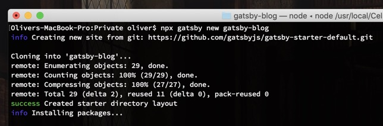

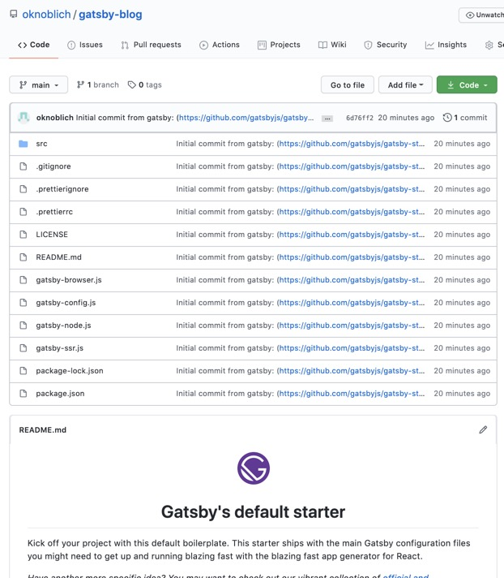

components/layout repräsentiert unser Design für alle Seiten. Innerhalb von /pages/ liegen unsere Unterseiten, wrapped in unser Layout. Gatsby erkennt alle Dateien die hier liegen und generiert die fertigen Unterseiten automatisch. Das ist alles bereits im initialen Setup enthalten.

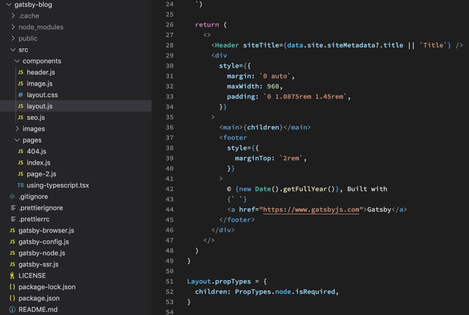

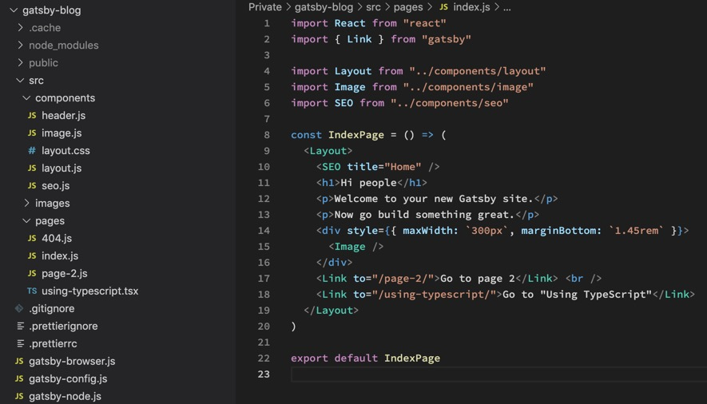

yarn run develop ausführen und localhost:8000 gibt uns sogar schon unseren fertigen Blog zum Basteln. Einfacher gehts wirklich nicht.

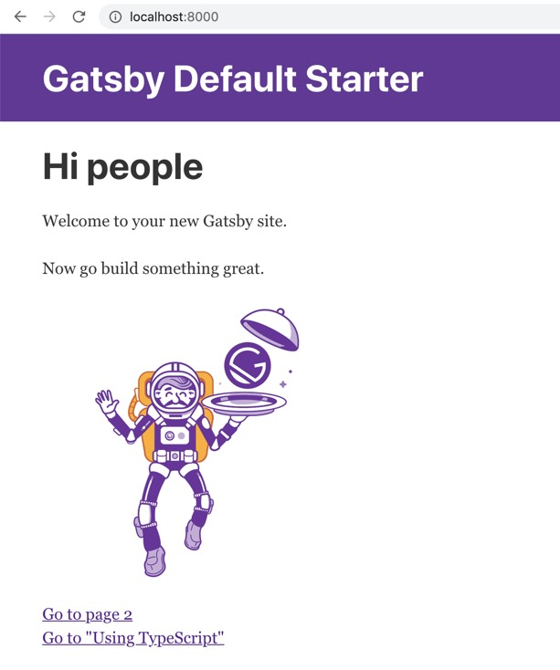

Im Prinzip können wir nun loslegen und bloggen. Einfach neue JS Dateien in PAGES erstellen und in der INDEX verlinken. Es geht aber noch einfacher. Mit Markdown. Dazu erstellen wir 1-2 Markdown Test Seiten und gehen in die GATSBY CONFIG JS. Dort fügen wir Markdown hinzu. Diese Datei wird am Ende von GraphQL ausgelesen.

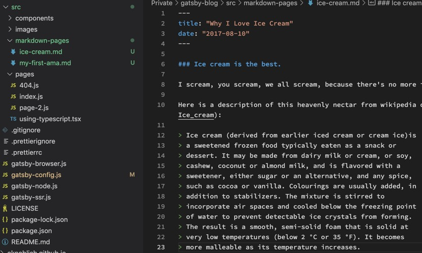

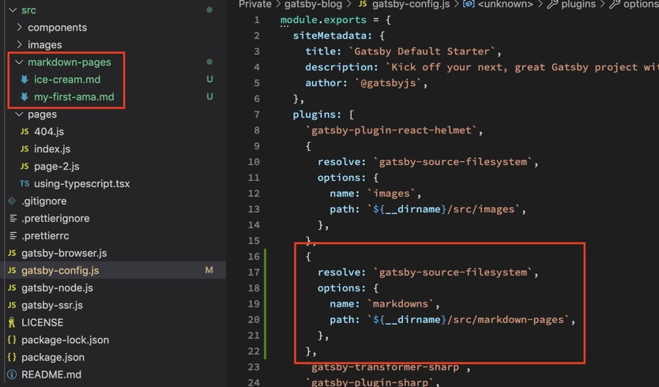

Nun installieren wir einen transformer um mit dem Markdown auch etwas anfangen zu können.

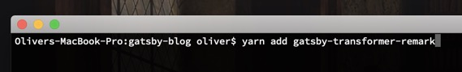

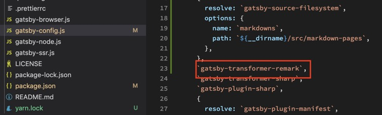

Auf http://localhost:8000/___graphql können wir nun GraphQL einsehen und allMarkdownRemark auswählen. Dort können wir alles lesen was wir brauchen:

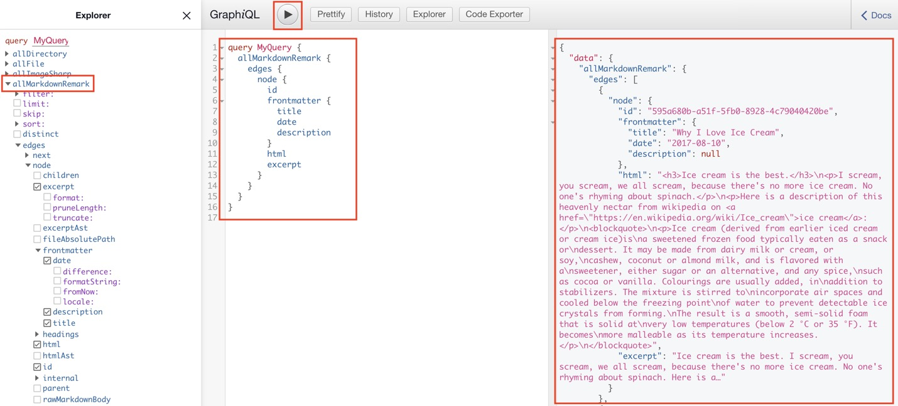

Dieser Block muss jetzt in unsere INDEX und wir können wit normalen React Code auf das Object zugreifen. Schon hat unsere Index alle Artikel und Ihre Anzahl, ihren Titel, ihr Datum und einen kleinen Preview Text.

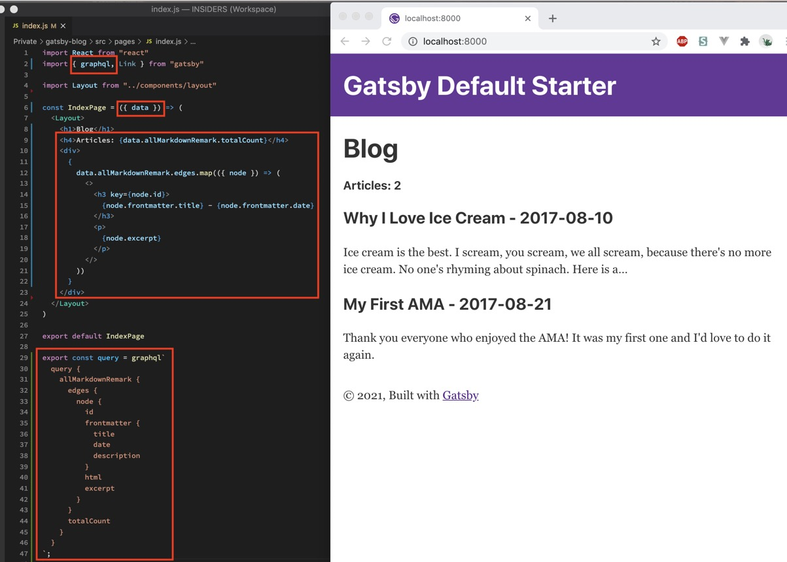

Jetzt müssen wir Unterseiten generieren. Um dafür Markdown zu nutzen erstellen wir uns ein eigenes Template und füllen die GATSBY NODE JS.

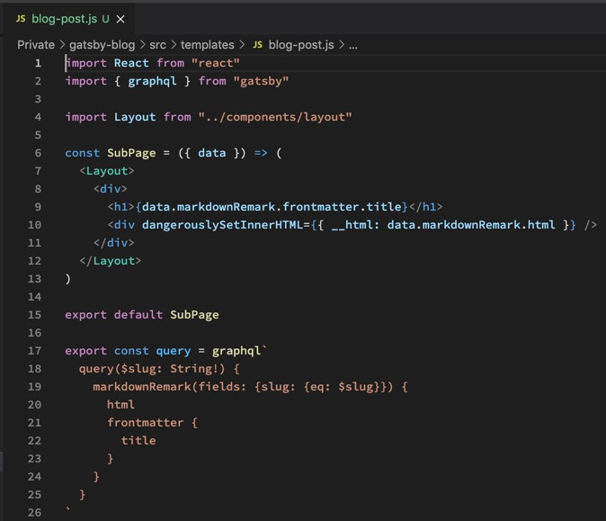

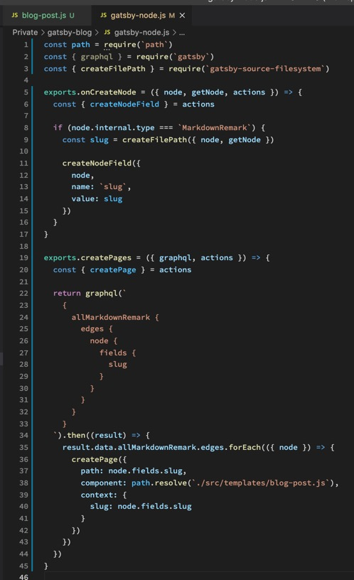

Danach können wir erfolgreich auf unsere generierten Unterseiten zugreifen: http://localhost:8000/ice-cream/

Jetzt können wir unsere Artikel noch nach Datum absteigend sortieren und einen Link hinzufügen.

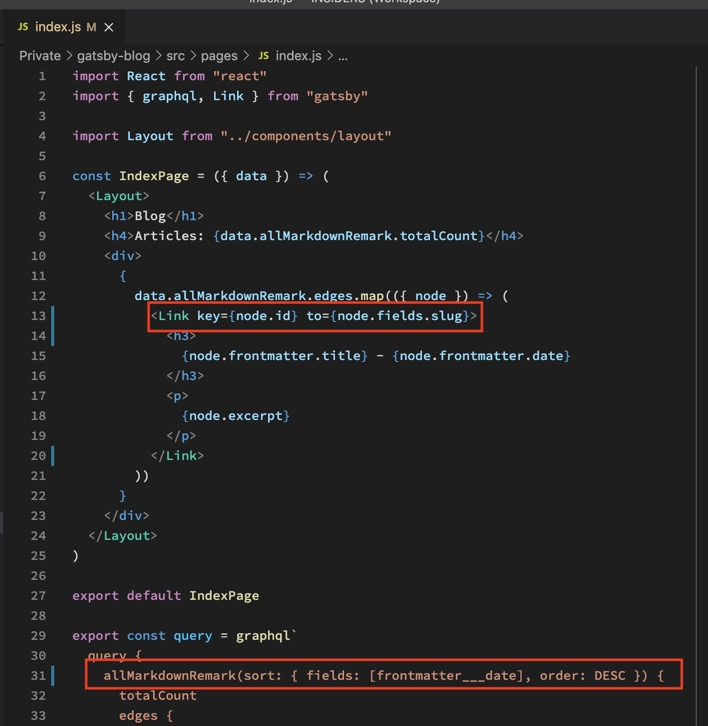

Damit wir das ganze auf Github sehen können installieren wir wieder gh-pages und fügen PATHPREFIX in die GATSBY CONFIG ein.

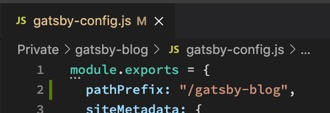

In die package.json kommen wieder PREDEPLOY und DEPLOY Scripte.

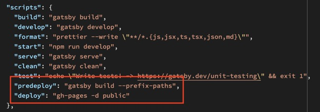

Und nach YARN RUN DEPLOY ist unser Blog live: https://oknoblich.github.io/blog/

Um Bilder nutzen zu können installieren wir GATSBY REMARK IMAGES und GATSBY PLUGIN SHARP.

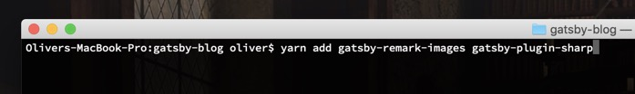

Das packen wir in die CONFIG

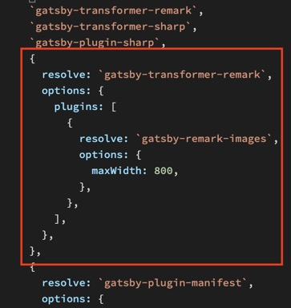

Und können im Markdown nun Bilder verlinken.

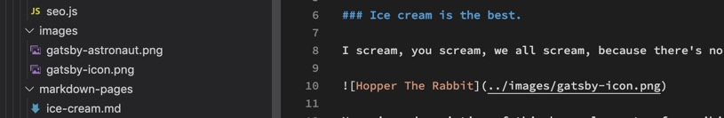
