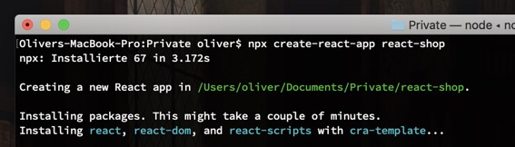
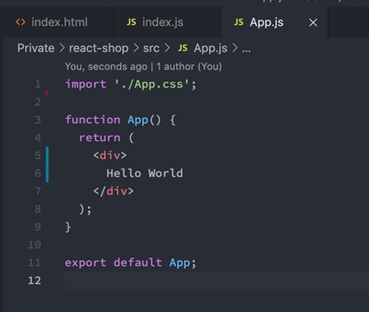
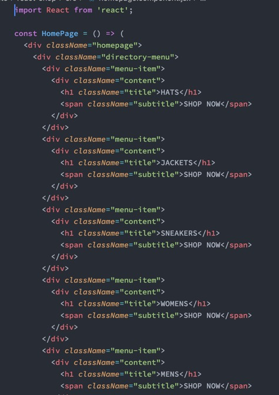
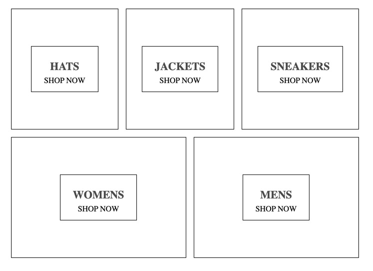
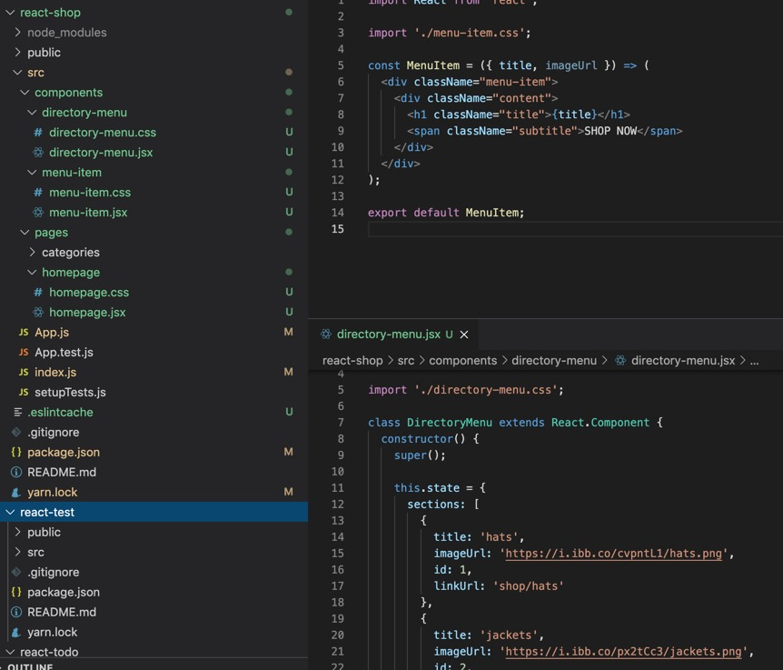
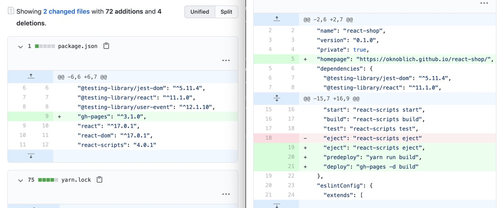

Am Anfang starten wir Create React App.

Wir entfernen das HTML und CSS dass von CRA erstellt wurde und starten frisch.

Dann erstellen wir eine Homepage Component und bauen darin erstmal eine Shop Einstiegsseite. Basic HTML und CSS innerhalb einer Functional Component.

Jetzt unterteilen wir das Projekt in COMPONENTS und PAGES, denn wir wollen nicht alles in eine einzige Datei werfen. Dabei achten wir darauf, Parent und Child Components sowie ihre CSS Dateien korrekt zu exportieren und zu importieren. Außerdem erstellen wir unseren ersten STATE mit einem Array aus Shopping Kategorien.

Das aktuelle Ergebnis:

Damit wir das jetzt auf GitHub Pages bekommen, installieren wir wieder das gh-pages package und die dazugehörigen Scripts.

Nachdem wir wieder YARN RUN DEPLOY ausgeführt haben, ist die Seite auch schon live: https://oknoblich.github.io/react-redux-shop/
