Wir installieren react-router-dom.

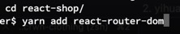

Wir importieren BrowserRouter und wrappen die gesamte App darum.

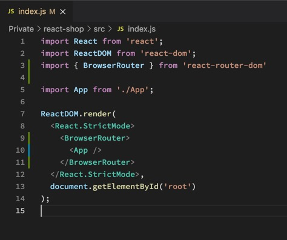

Wir importieren Switch und Route und nutzen es um zwischen Pages zu navigieren.

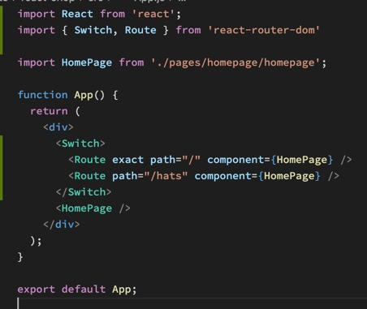

Damit wir kein Prop Drilling veranstalten müssen und trotzdem alle Childs Zugang zum Router haben, importieren wie withRouter wo wir es brauchen und exportieren die Component damit.

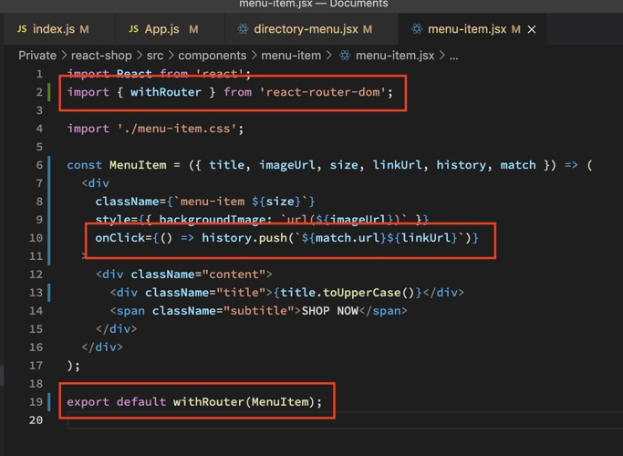

Wir erstellen eine Shop Page und verlinken sie im Router.

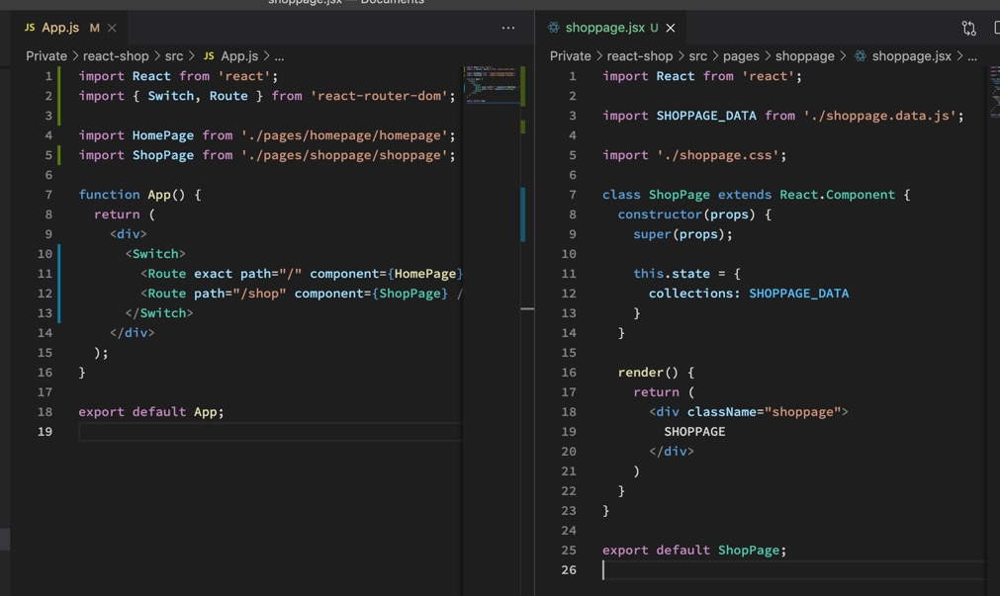

Dann erstellen wir eine CategoryPreview Component und mappen sie auf unserer Shop Page.

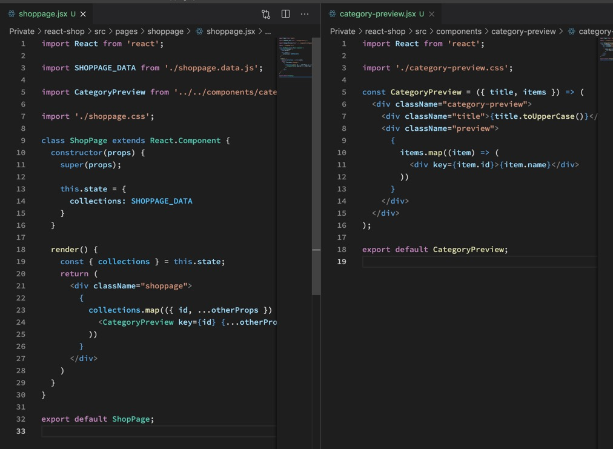

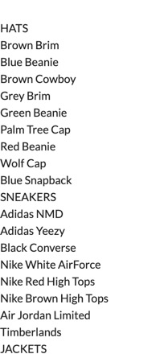

Wir wollen aber nur 4.

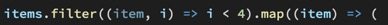

Wir erstellen eine Header Component und weitere Unterseiten, zwischen denen wir mit dem Header navigieren können.

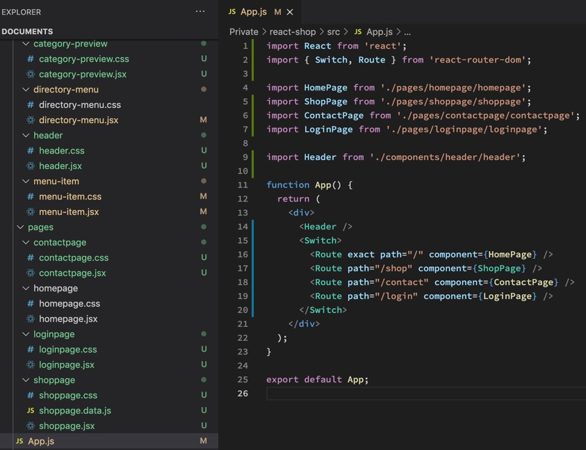

Wir erstellen ein Login Formular und handlen schon einmal ein wenig den State. Bei Änderungen wird der Value live in den State geschrieben, beim Submit des Forms wird der State, und somit auch die Inputs, geleert.

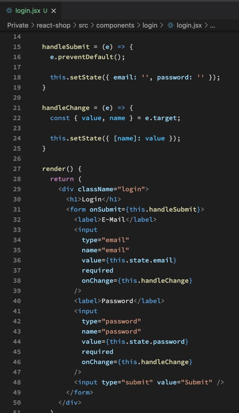

Daraus machen wir nun eine Form Input Component und eine Button Component.

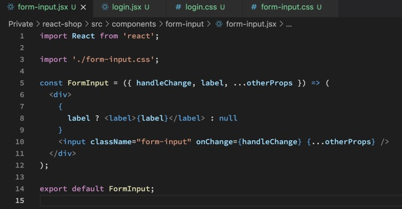

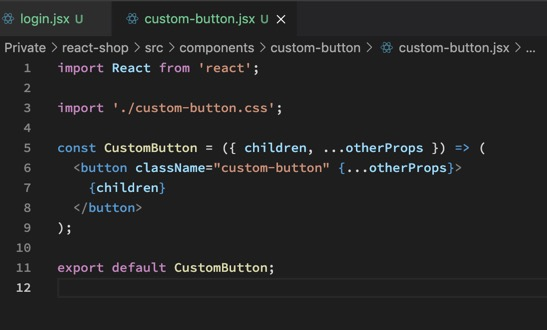

Console Log zeigt uns, unsere Components funktionieren wie sie sollen.

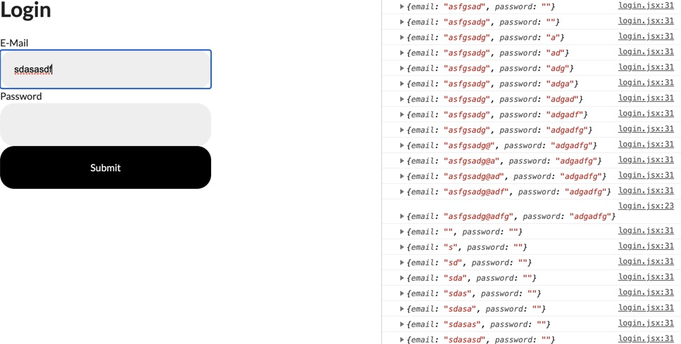

Wir pushen alles zu GitHub und rufen wieder gh-pages DEPLOY auf den Plan.

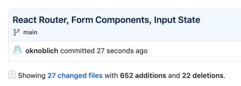

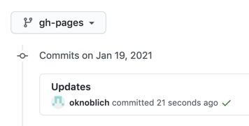

Die Navigation läuft aber nicht, da im Gegensatz zu localhost die App nun hinter /react-redux-shop/ liegt. Abhilfe schaffen wir uns, indem wir den BrowserRouter mit HashRouter ersetzen.

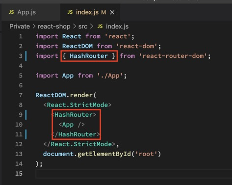

Nun läuft die App im /#/ Mode und wir können auch auf GitHub Pages navigieren.
