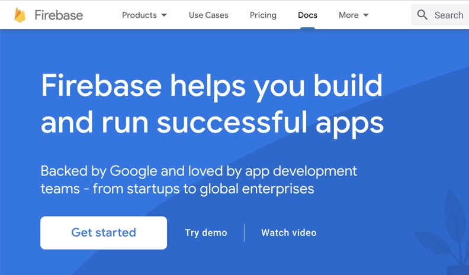

Wir besuchen die Firebase Console auf https://console.firebase.google.com/ und erstellen ein neues Projekt.

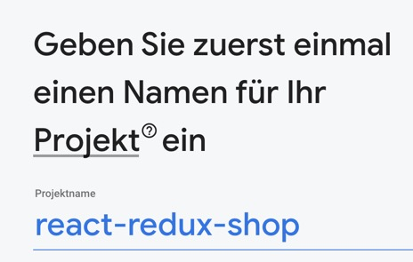

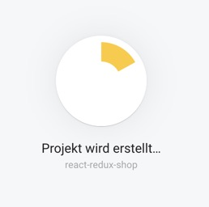

Wir fügen Firebase zu unserer App hinzu.

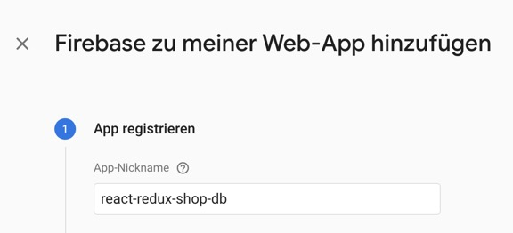

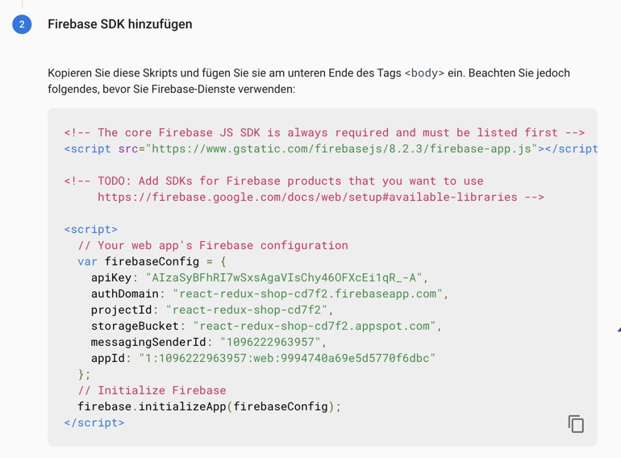

Wir fügen Firebase zu unserem Projekt hinzu.

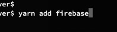

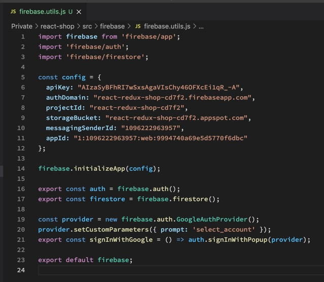

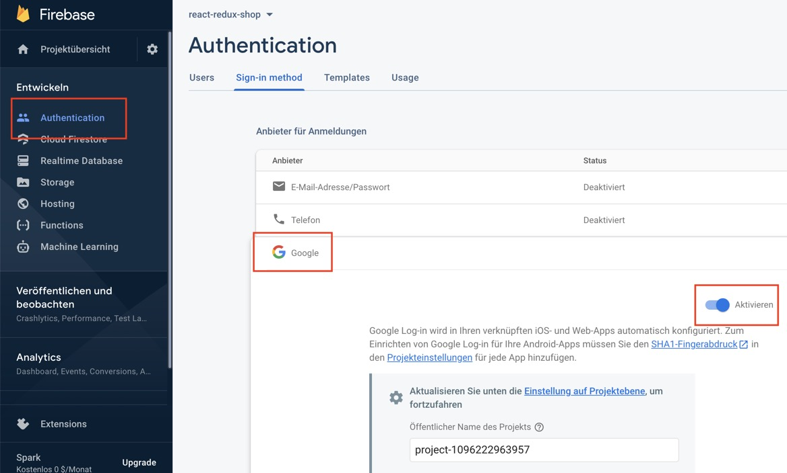

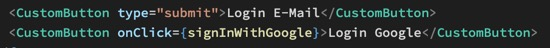

Und schon ist der Google Login fertig.

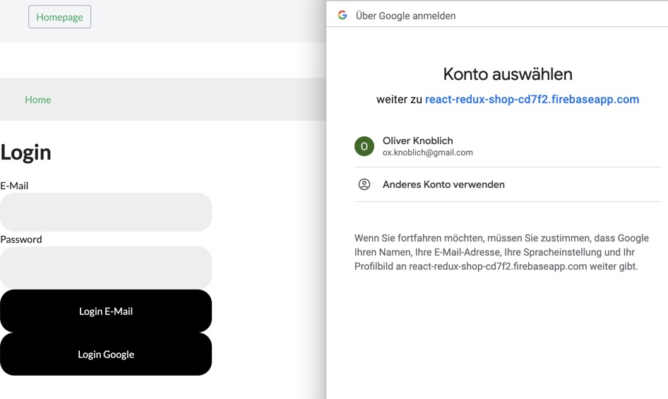

Wir fügen nun einen State zur App hinzu, der uns sagt ob der User ein- oder ausgeloggt ist.

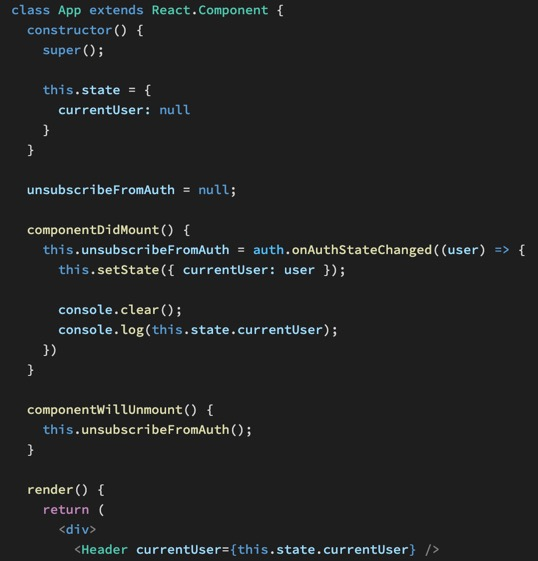

Und am Ende noch einen Logout Button in den Header.

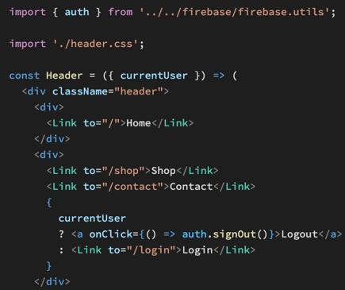

Und dann fügen wir noch unsere GitHub URL ins Firebase Backend ein, damit Firebase weiß die URL ist erlaubt.

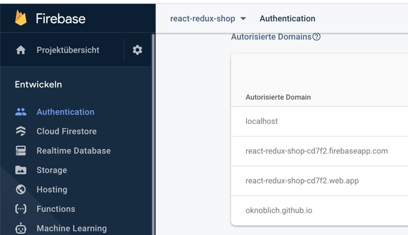
