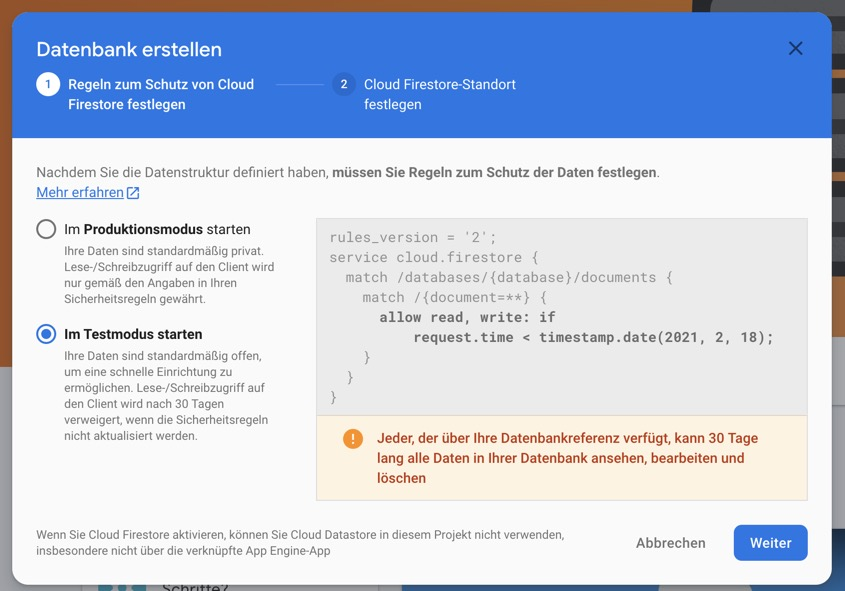
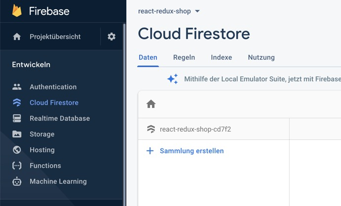
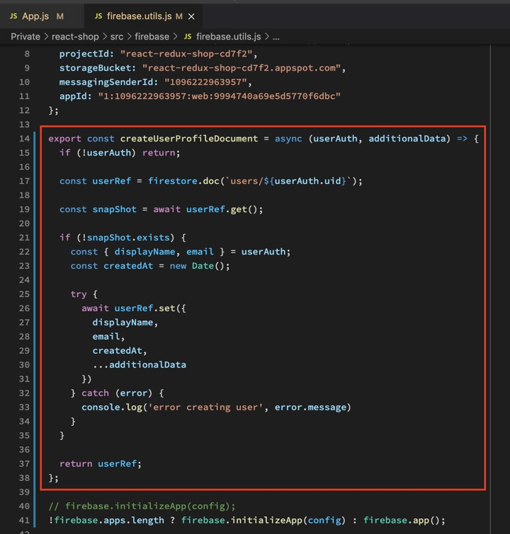
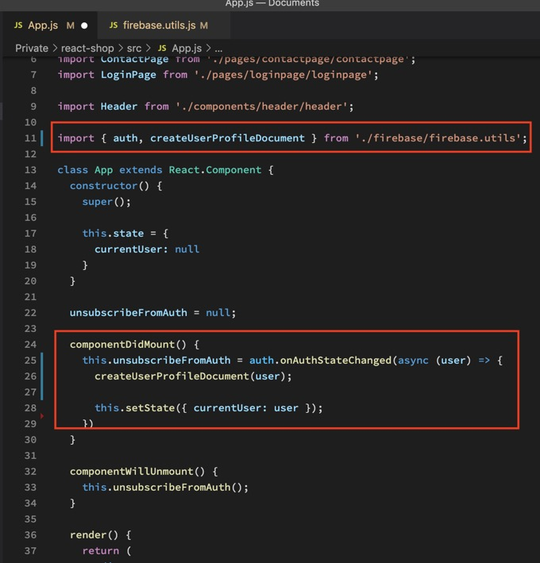
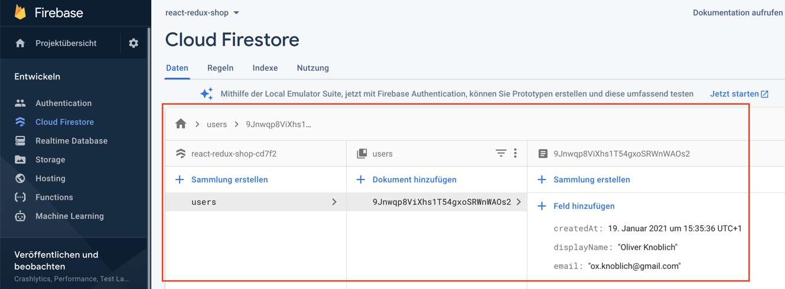
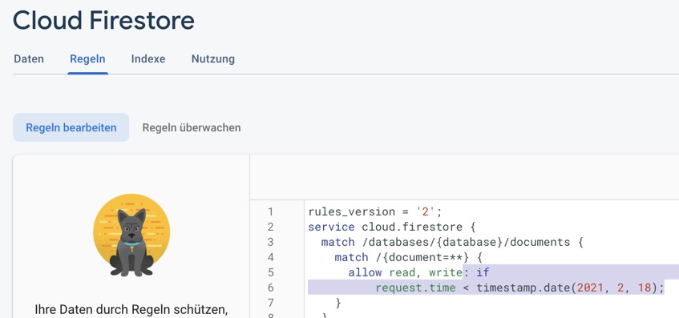
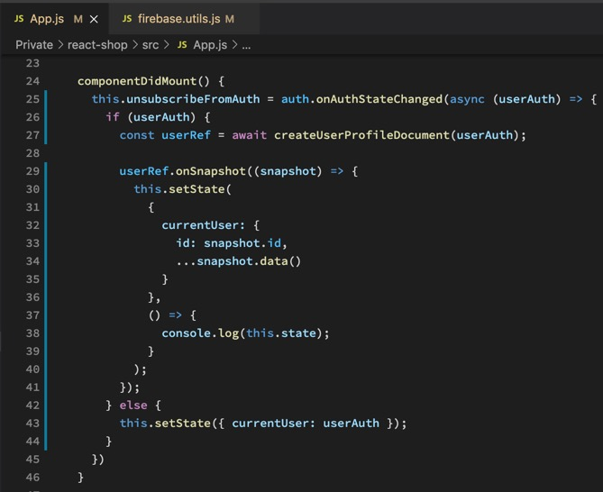

Als erstes erstellen wir eine Datenbank in der Cloud.

Dann sorgen wir dafür dass unsere App einen neuen User in unsere neue Datenbank schreibt.

Dann entfernen wir das Timelimit aus der Datenbank, damit in 4 Wochen noch alles funktioniert.

Dann sorgen wir dafür dass der eingeloggte User auch in unserem State landet.

