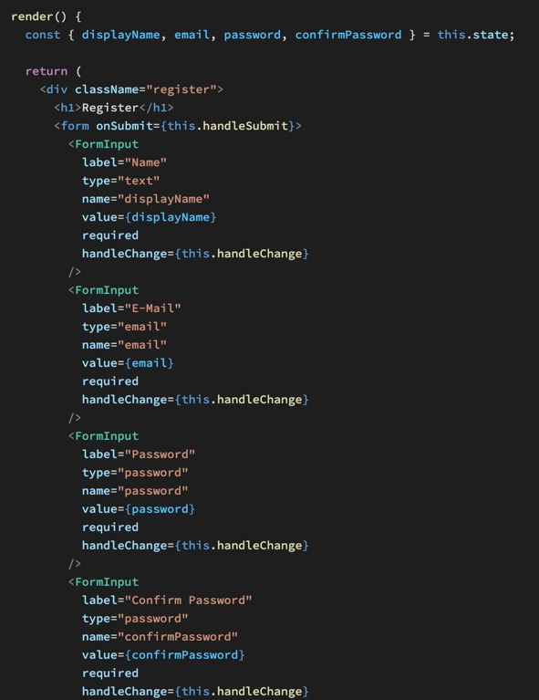

In JSX erstellen wir ein Registrierungsformular inkl State Handling. Der Großteil der Arbeit ist bereits erledigt, das heißt alles was wir brauchen ist eine Datei die auf vergangenes aufbaut.

In Firebase muss Email/Passwort aktiviert werden.

Und schon funktioniert unsere Registrierung mit Email Adresse.

Wenige Zeilen in der Login Component später können wir uns mit diesen Daten auch einloggen.

Fertig. Wir haben eine komplett funktionierende Registrierung mit E-Mail und einen Login mit E-Mail und Google.

https://oknoblich.github.io/react-redux-shop/#/login

