REDUX ersetzt STATE und macht STATE in REACT generell SKALIERBARER.

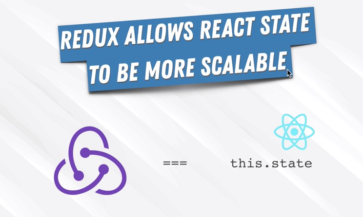

Der Flow of Data wird immer unübersichtlicher je größer die App wird.

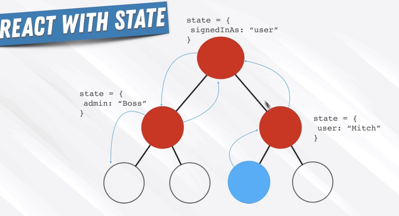

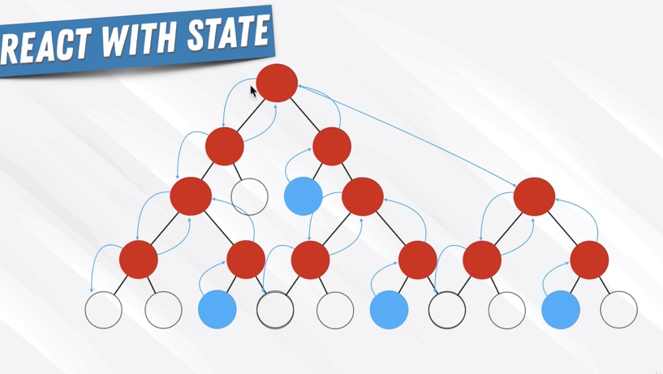

Redux tritt an um dieses Problem zu lösen.

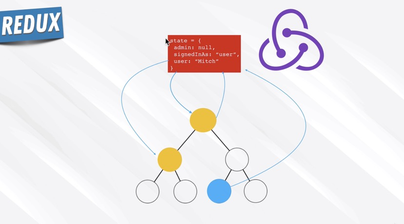

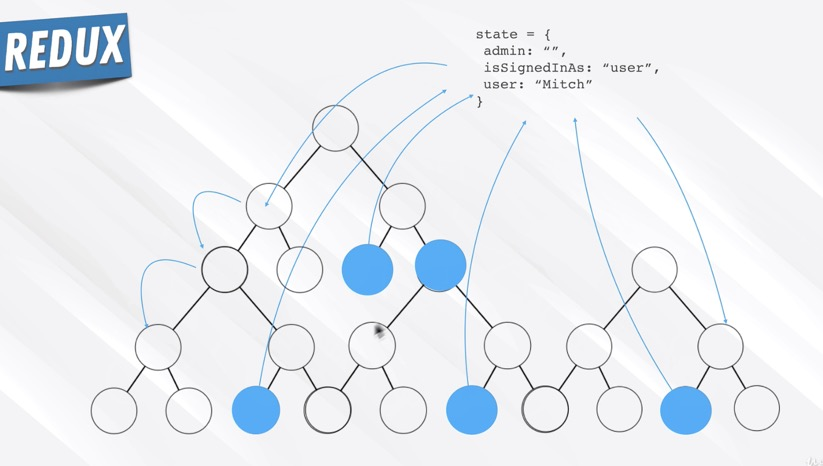

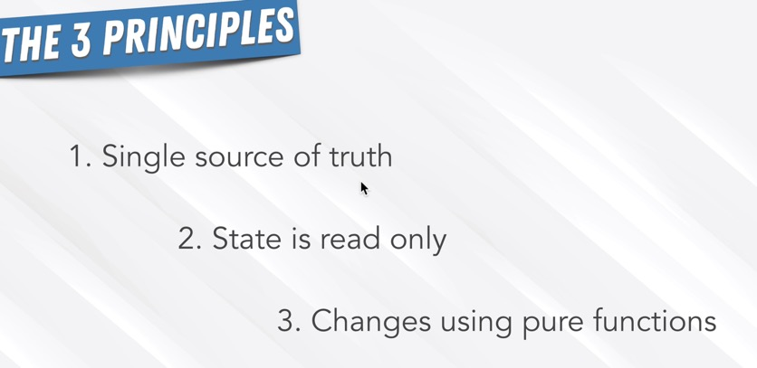

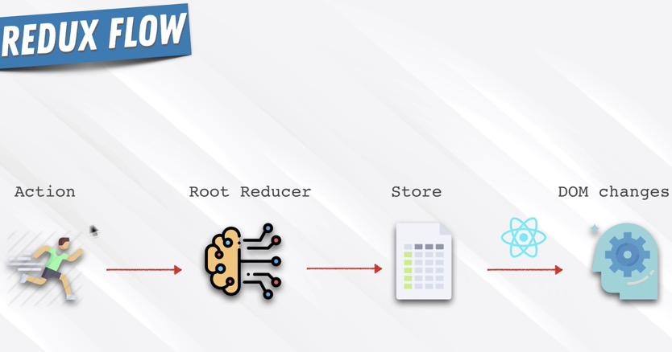

Der FLUX Pattern von Redux ersetzt den klassischen MVC Pattern.

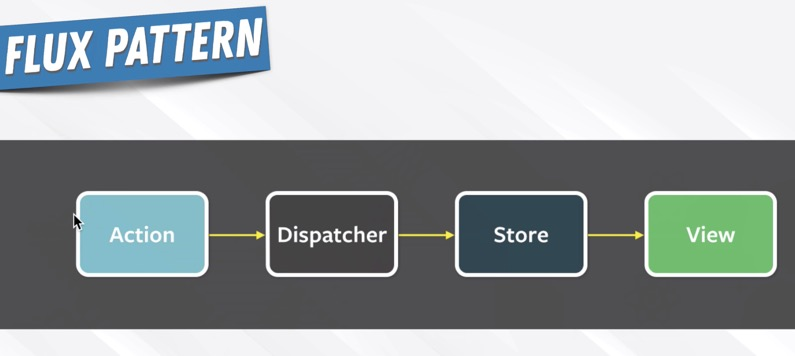

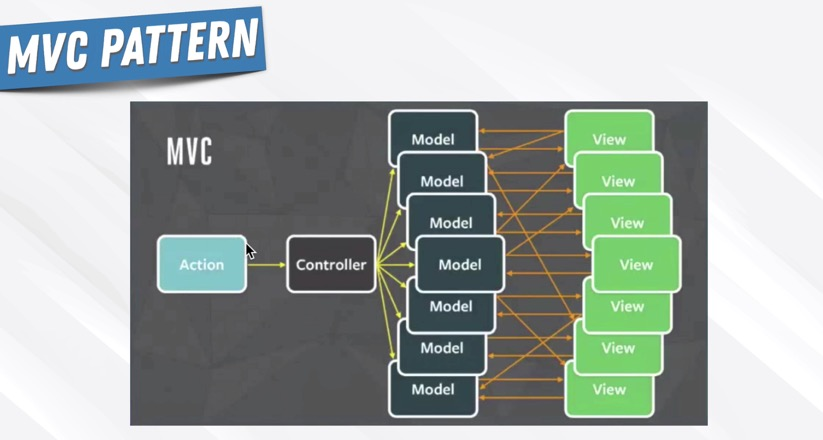

Redux will PROP DRILLING verhindern.

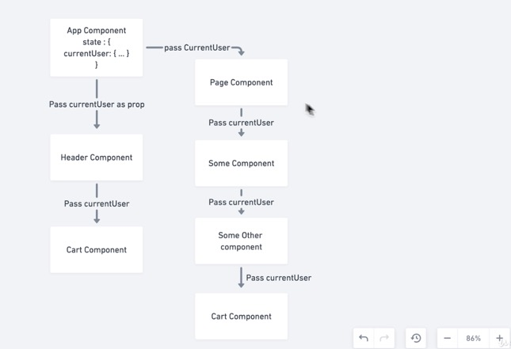

Components triggern ACTIONS die wiederum REDUCER triggern. Diese schreiben einen globalen State der wiederum zurück zu den Components geleitet wird. Unidirectional Data Flow.

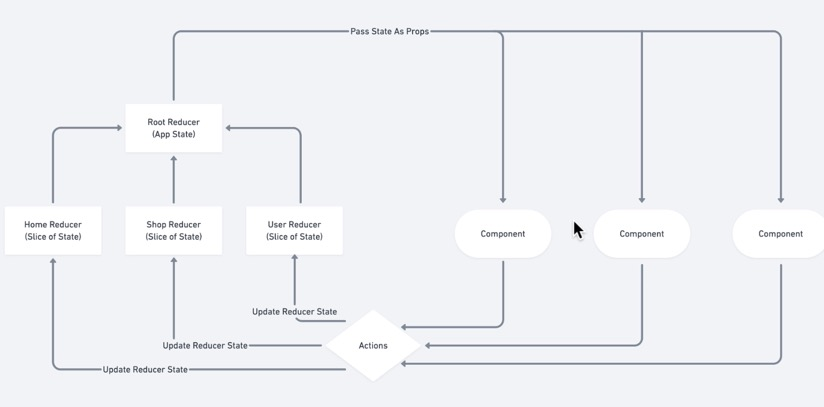

Eselsbrücken:

Ein App besteht aus Functions, nennen wir sie ANGESTELLTE. Wenn der User im UI rumklickt, erteilt er verschiedenen ANGESTELLTEN verschiedene Aufgaben. Ein Chaos entsteht, alle rennen rum, machen was sie wollen. REDUX, der BOSS, will dies ändern. Er führt REDUCER ein (die selbst nichts weiter als Functions sind). REDUCER sind ABTEILUNGSLEITER Functions. Klickt der User im UI rum, gehen die Aufgaben an die ABTEILUNGSLEITER, die erstmal prüfen ob überhaupt eine Änderung stattgefunden hat. Wenn nicht, machen sie nichts. Wenn doch, leiten die ABTEILUNGSLEITER die Änderungen hübsch verpackt an den ROOT REDUCER weiter (die rechte Hand vom BOSS). Nur der ROOT REDUCER führt nun die Änderungen im UI durch. Die ANGESTELLTEN machen gar nichts mehr im UI.

JEDE Aktion in der UI wird an ALLE Reducer gesendet. Ein Reducer ist nicht weiter als eine Function. Es nimmt den aktuellen State und eine Action. Checkt, ob diese Action irgendwas mit einer eigenen Abteilung zu tun hat. Wenn ja, stelle einen neuen State her (der alte State kann nicht verändert werden, er ist immutable), wenn nein, gib den State im Original zurück.

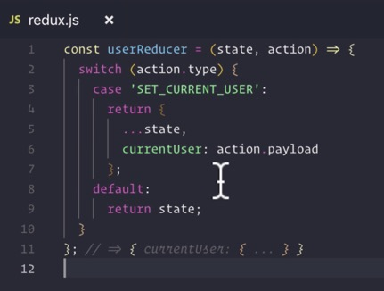

In diesen Prozess können wir eine MIDDLEWARE einbauen. Ein Sekretariat, welches die Action noch vor dem Abteilungsleiter bekommt.

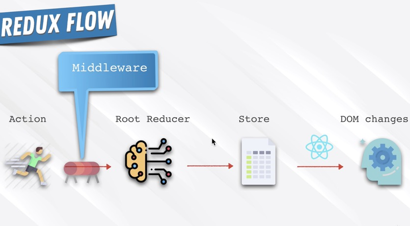

Um Redux zum Laufen zu bekommen müssen wir mehrere Dinge in unsere App installieren: REDUX selbst, REACTREDUX, da Redux nicht nur mit React verwendet werden kann, und REDUXLOGGER als unsere erste Middleware.

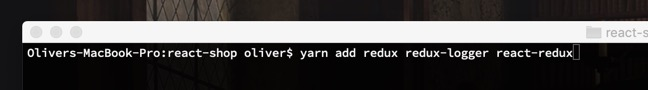

Danach brauchen wir den PROVIDER in der index.js. Die Elternkomponente unsere gesamten App.

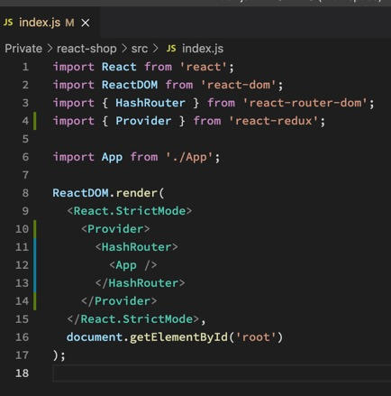

Dann schreiben wir als erstes unseren ersten REDUCER (den ersten Abteiliungsleiter).

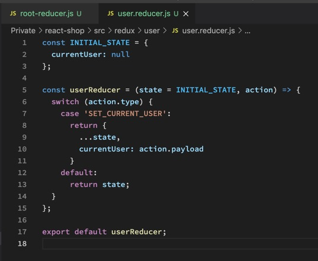

Und als zweites unseren ROOT REDUCER (die rechte Hand vom Boss) der alle Reducer kombiniert.

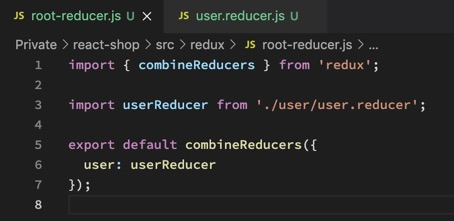

Jetzt müssen wir unsere STATE noch irgendwo hin packen damit der PROVIDER (in der index.js) ihn verteilen kann. Wir erstellen dazu einen STORE mit dem Ergebnis unseres ROOTREDUCERS und allen MIDDLEWARES die wir noch in den Mix packen wollen.

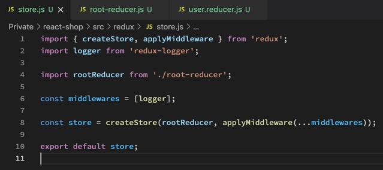

Jetzt bekommt der Provider endlich unseren fertigen Store.

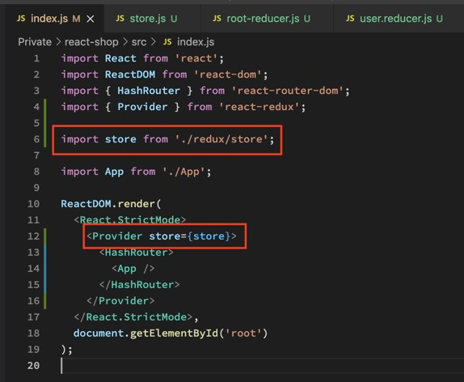

Am Ende fehlt noch ein finales Puzzlestück. Die Functions in unsere App (Mitarbeiter) müssen irgendwie mit den Reducern (Abteilungsleitern) kommunizieren. Dazu erstellen wir ACTIONS. Die Actions haben TYPE und PAYLOAD, genau die Dinge, die die Reducer bei ihrer Arbeit abfragen.

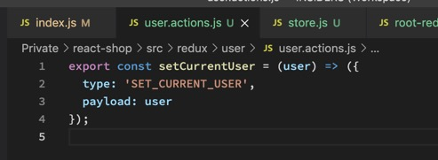

Unsere neue Ordnerstruktur:

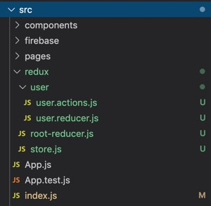

RECAP

Um zukünftig mit dem STATE zu interagieren triggern wir ACTIONS. Diese ACTIONS werden an REDUCER übergeben, die die PAYLOAD in einen neuen STATE schreiben wenn der TYPE übereinstimmt. All die REDUCER schnappt sich der ROOT REDUCER, der mit COMBINEREDUCERS alle zu einem Objekt vereint. Dann erstellt CREATESTORE einen neuen STORE mit dem Inhalt des ROOTREDUCERS und aller benötigten MIDDLEWARES. Diesen STORE schnappt sich der PROVIDER und gibt ihn an unsere App.
