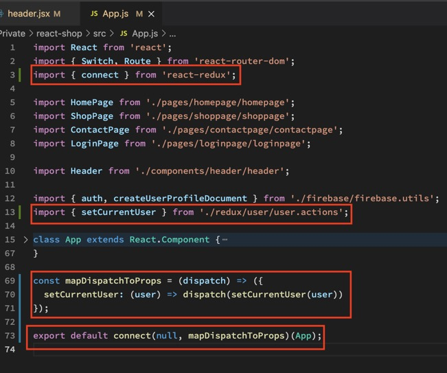
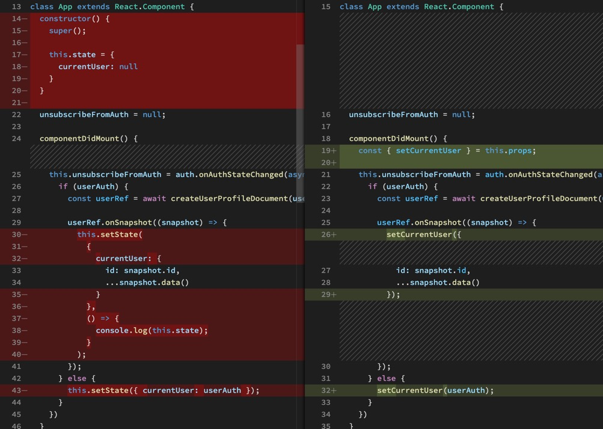
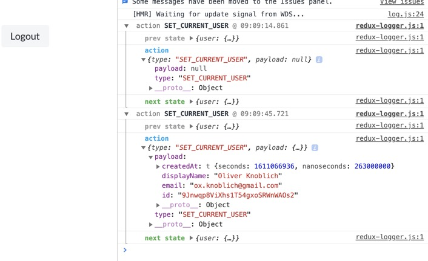

Jetzt müssen wir das ganze in unseren Components zum Laufen bekommen. Angefangen mit dem Header. Wir holen uns CONNECT und geben unserem Header mit MAPSTATETOPROPS Superpowers. Der STATE kommt nun nicht mehr von der Eltern-Component sondern von REDUX. Das heißt, wir können die Prop in App.js entfernen. Components können sich Props nun von der HOF CONNECT selber holen und sind nicht mehr auf ihre Eltern angewiesen. Prop Drilling erfolgreich verhindert. Wir LESEN nun den STATE von REDUX von wo auch immer wir wollen.

Jetzt müssen wir ihn noch SCHREIBEN können. Dazu holen wir uns CONNECT in die App und gleich noch unsere ACTION mit dazu. Dann verbinden wir das wie schon den Header mit MAPDISPATCHTOPROPS und können den STATE nun auch SCHREIBEN.

Ein Menge Setup und Boilerplate Code (der größte Kritikpunkt an Redux der regelmäßig auftaucht) aber es ermöglicht uns nun unseren ganzen SETSTATE Code mit einem einfach Function Call zu ersetzen.

Unsere MIDDLEWARE zeigt uns in der Console was passiert. Wir können also alle console.logs entfernen und sind immer up-to-date.

FAZIT: Unsere Components müssen nun nicht mehr miteinander kommunizieren, sie kommunizieren ab sofort nur noch mit Redux.
