Um eingeloggt nicht auf den Login zuzugreifen, Redirecten wir auf Home:

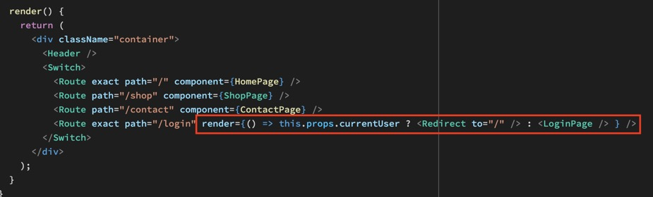

Best Practice: Alle ActionTypes in einem Objekt versammeln:

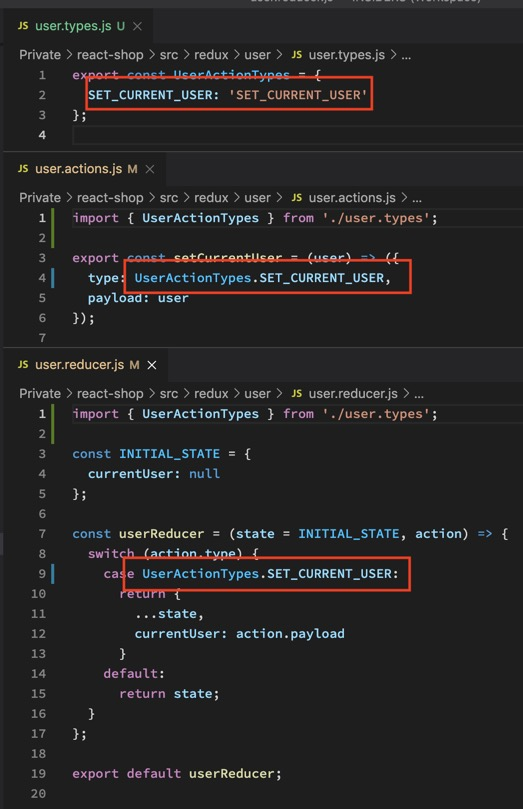

Jetzt wollen wir einen Einkaufswagen bauen der toggelt. Das HTML (bzw JSX) und CSS sind wie immer schnell gemacht. Aber: REDUX AUCH. Denn wir haben fast alles schon einmal geschrieben. Das heißt, wir COPY-PASTEN unseren Redux User Ordner und ersetzen „user“ mit „cart“. Dann verteilen wir ACTION und MAPSTATETOPROPS an die Stellen die es brauchen (CartIcon und Header).

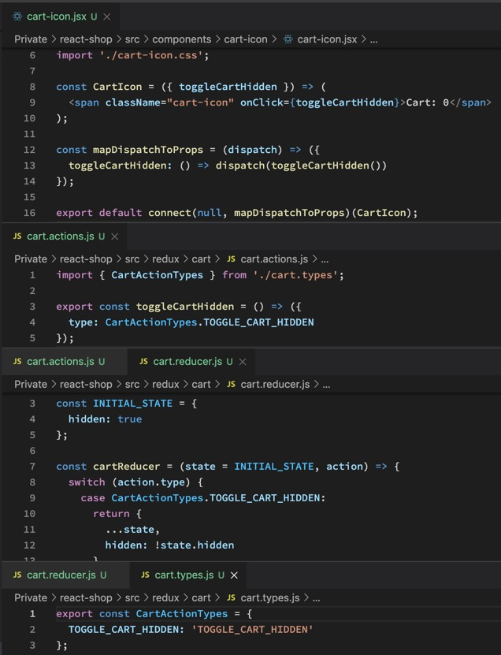

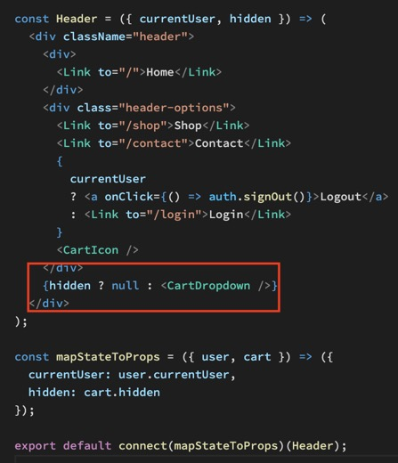

Schon toggelt unser Einkaufswagen.

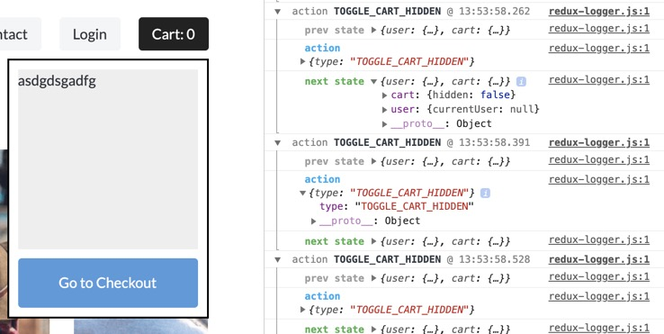

Jetzt wollen wir Items hinzufügen, sobald wir im UI auf einen der „Add to Cart“ Buttons klicken. Dazu COPY-PASTEN wir vieles von unserem Redux Code und passen es so an, dass es ADD_ITEM triggert.

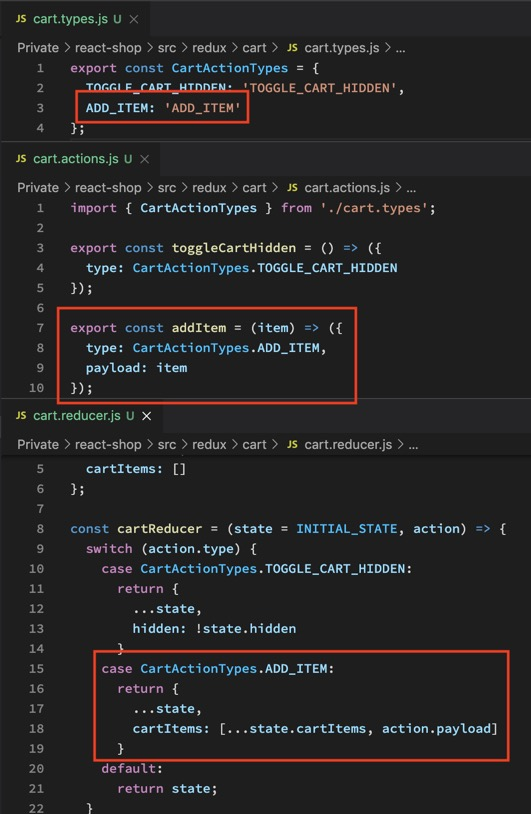

Jetzt müssen wir es nur noch in unseren CATEGORY ITEM hinzufügen und triggern, sobald man auf einen Button klickt.

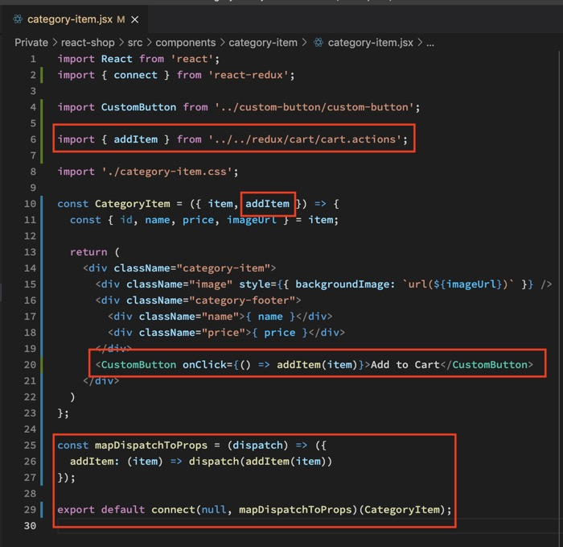

Und schon landet das Object im Redux Store, wie man in der Konsole sehen kann.

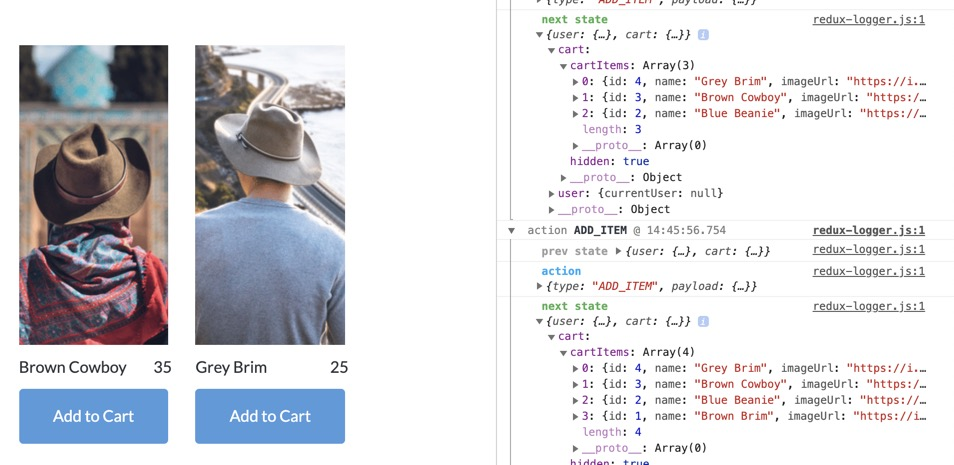

Jetzt müssen wir dafür sorgen, dass doppelte ITEMs als das selbe Item hinzugefügt werden, nur in höherer Anzahl. Wir coden dazu eine UTIL Function.

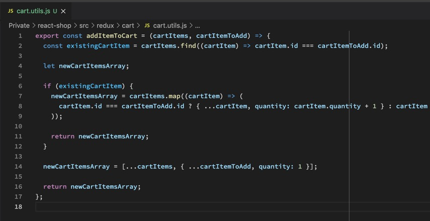

WAS PASSIERT HIER? Wir checken erstmal ob 2 übereinstimmende IDs gefunden werden. Wenn nein, gib den originalen Array zurück, füge aber das neue Items hinzu, und füge diesem neuen Item eine Quantity von 1 hinzu. Wenn ja, laufe alle Items einmal durch und checke welches doppelt ist. Wird eines gefunden, wird es aufgespreaded und die Quantity wird um eines erhöht.

Das verpacken wir jetzt in unserem Reducer:

Und schon erhöht sich die Quantity.

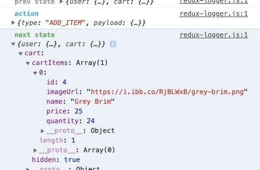

Jetzt müssen wir nur noch den ITEM ARRAY aus dem REDUX STORE in unserem CART DROPDOWN anzeigen. Dazu editieren wir nur CART ITEM und CART DROPDOWN. Denn nur diese Compontents benötigen den REDUX STORE:

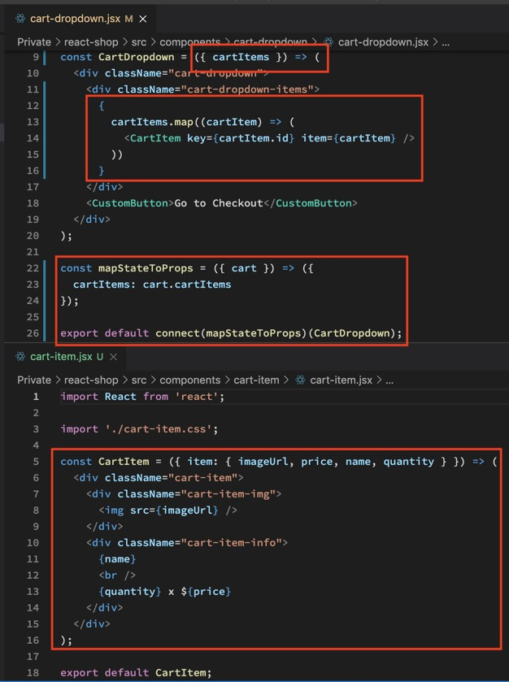

Um dem Counter die korrekte Anzahl an Items zu geben, nutzen wir REDUCE und addieren alle QUANTITIES zusammen.

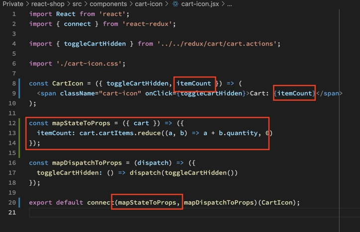

Und fertig ist der Shopping Cart.

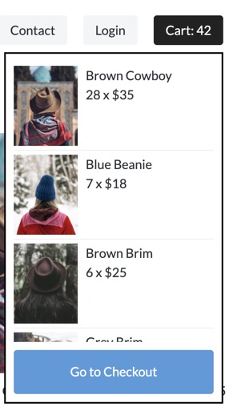
