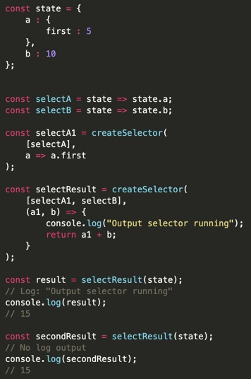

Der gesamte Redux Store wird bei einem State Change neu geschrieben. Damit werden auch Component Rereders getriggert bei denen gar kein Update stattfand. Das geht bei sehr teuren Berechnungen zu Lasten der Performance. Hier kommt MEMOIZATION ins Spiel. Wir installieren hierfür RESELECT.

Mit RESELECT schreibt man SELECTOR FUNCTIONS. Diese nehmen den State als Argument und returnen etwas dass auf diesem State basiert. Hier eine sehr gute Erklärung von einem der aktuellen Redux Maintainer:

Idiomatic Redux: Using Reselect Selectors for Encapsulation and Performance https://blog.isquaredsoftware.com/2017/12/idiomatic-redux-using-reselect-selectors/

Selector Functions können jeden Namen haben, aber normalerweise beginnen sie mit GET oder SELECT. Sie akzepieren zwei Arguments, eine Reihe von INPUT SELECTORS und eine OUTPUT SELECTOR FUNCTION. In dieser Function kann man machen was man will. Am Ende returned createSelector() IMMER eine neue FUNCTION.

In Code dargestellt:

Werden die gleichen Argumente wie zuvor in eine Function gegeben, wird die teure Berechnung darin nicht erneut ausgeführt. Es wird sich an das Ergebnis „erinnert“.

In unserer Codebase sieht das nun so aus:

Der ItemCount, den wir per mapStateToProps in unsere Component als Prop geben, wird nun nichtmehr direkt an Ort und Stelle berechnet, sondern ruft eine Function importiert aus unseren Selectors auf. Diese führt die Operation aus, aber nur, wenn die Arguments anders sind als zuvor.

Das gleiche können wir nun im Dropdown machen, aber nicht mit dem Item Count, sondern mit den Items selbst.

Die Änderungen in GIT im Überblick:

FAZIT: Wir lesen den State nicht mehr direkt in der Component, sondern überlassen dass unseren verschiedenen Selektoren die wir im Redux Ordner geschrieben haben.

Jetzt können wir das gleiche im HEADER machen. Dort haben wir den USER und den HIDDEN boolean.

Damit wir jetzt nicht zig mal den STATE referieren müssen, holen wir uns CREATESTRUCTUREDSELECTOR. Damit können wir das ganze abkürzen:

Unseer Code wird langsam aber sicher aufgeräumter und einfacher zu lesen. Jetzt übernehmen wir diesen Patteren für alle Components, und benutzen gleichzeitg auch überall CREATESTRUCTUREDSELECTOR.

Die finalen Änderungen in GIT:

