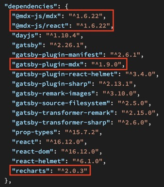
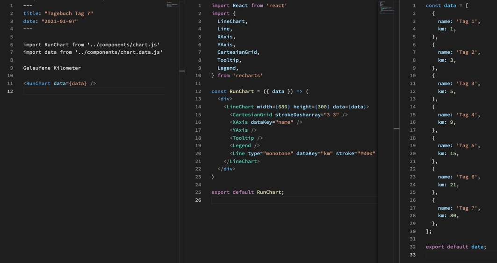
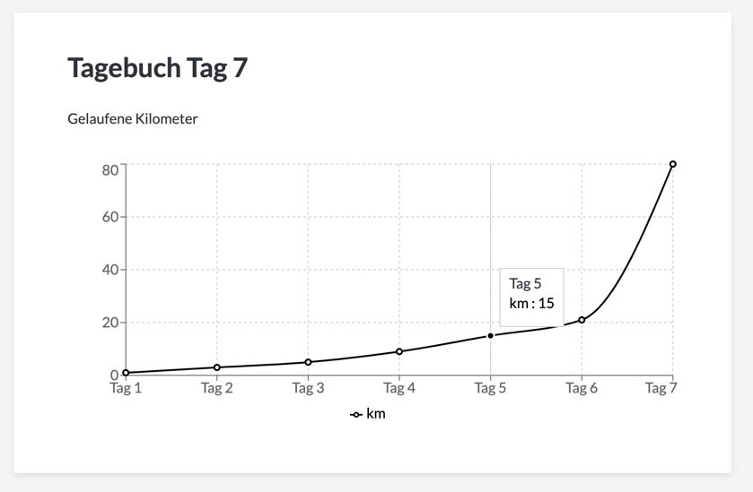

Um React Components in Markdown nutzen zu können müssen wir erst einmal ein paar neuen Packages installieren.

Wir folgen am besten der Anleitung von Gatsby, die sehr detailiert ist:

Getting Started from scratch https://www.gatsbyjs.com/docs/how-to/routing/mdx/

oder

Migrating Remark to MDX https://www.gatsbyjs.com/docs/how-to/routing/migrate-remark-to-mdx/

Wenn wir nun z.B. Recharts installiert haben, können wir uns data und component Files erstellen und diese einfach ins Markdown einbinden:

Was dann zu folgendem Ergebnis führt:

