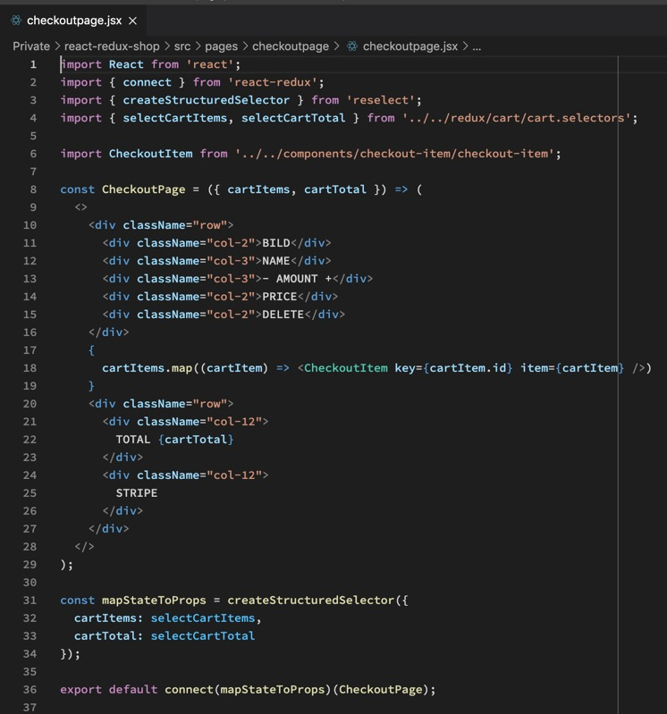
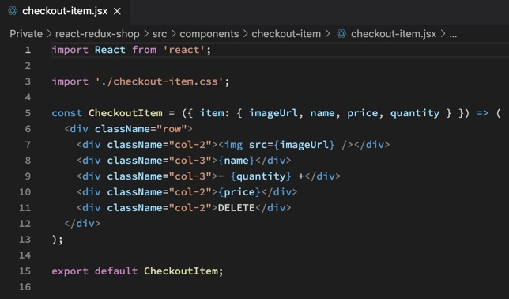
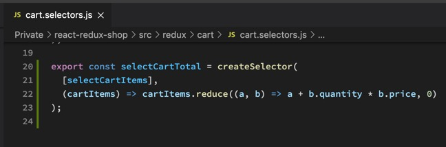
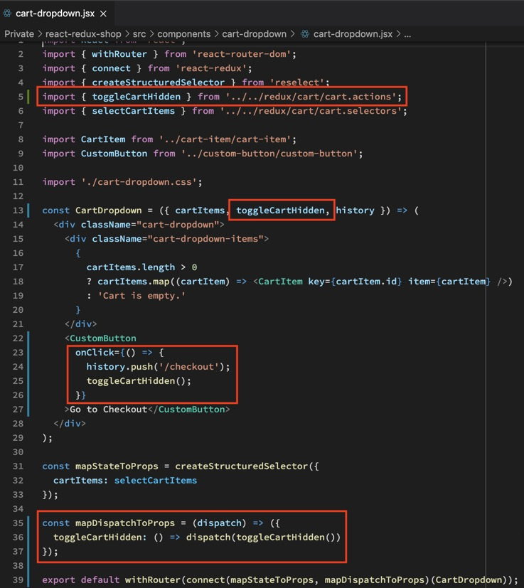
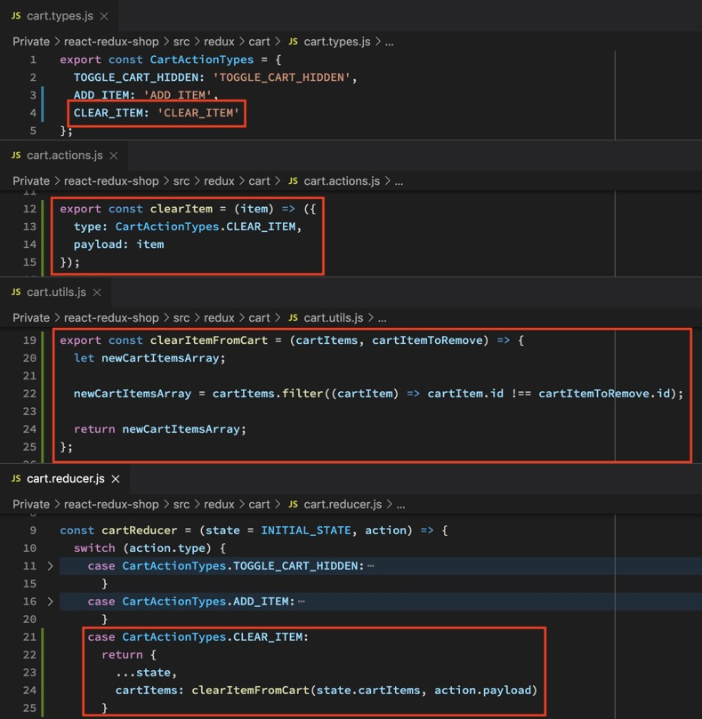
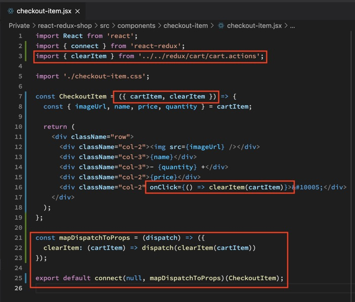
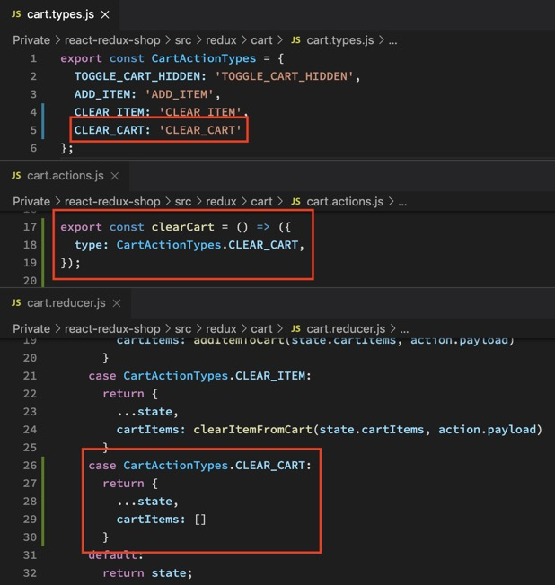
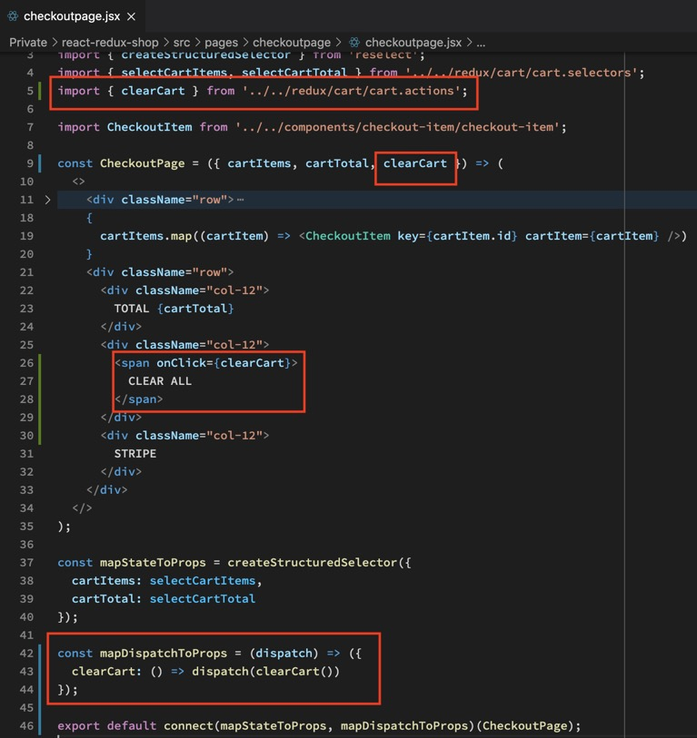

Für die Checkout Page müssen wir das Rad nicht neu erfinden. Wir wiederholen und copy-pasten viel von dem was wir bereits gelerent und gecodet haben.

Jetzt schließen wir den Cart wenn man den Checkout öffnet.

Wir fügen eine CLEAR Function hinzu die Items, unabhängig von ihrer Anzahl, komplett entfernt.

Am Ende kommt noch eine CLEAR ALL Function hinzu die alles löscht.

