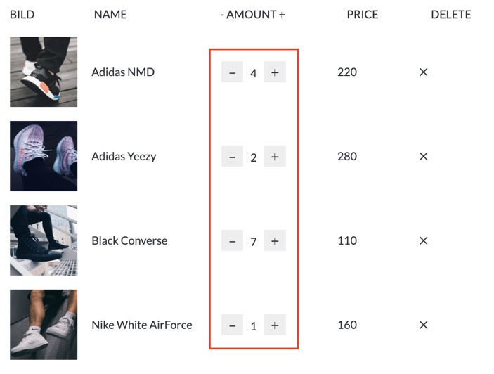
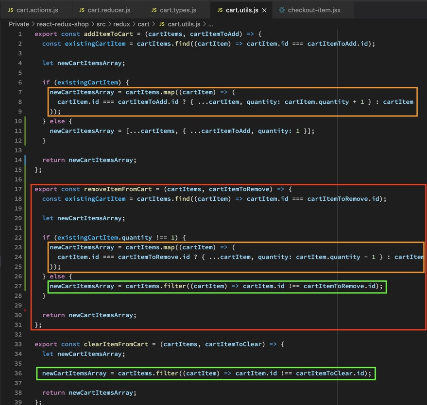
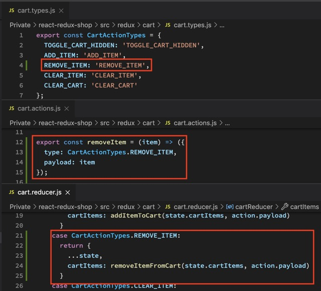
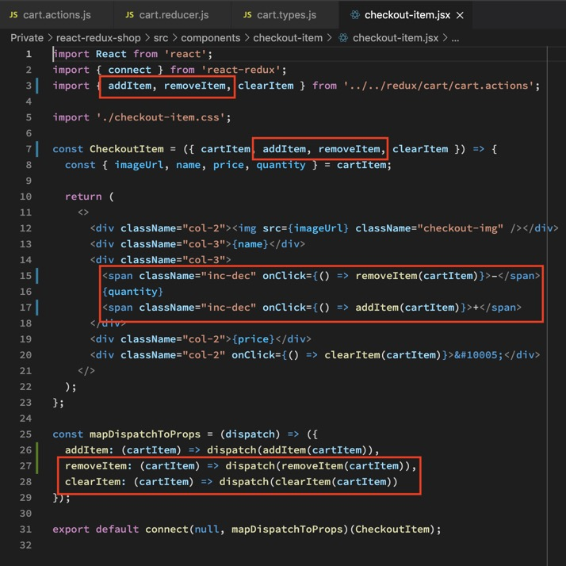

ADD ITEM und CLEAR ITEM hatten eine klare Aufgabe. Ein Item hinzufügen oder ein Item komplett entfernen. REMOVE ITEM kann jedoch verschiedene Dinge aufrufen. Ich kann die Anzahl verringern wenn ich mehrere Items habe ODER das Item komplett entfernen wenn ich nur eines habe und dann REMOVE klicke.

Dazu müssen wir nichts weiter tun als die beiden bereits geschriebenen Funktionen zu vereinen und abzufragen, ob EIN Item im Cart liegt oder nicht.

Der Rest ist Redux Business as usual:

