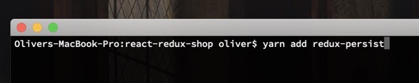
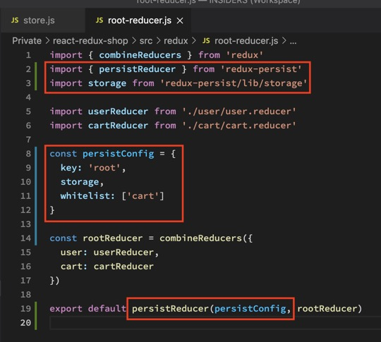
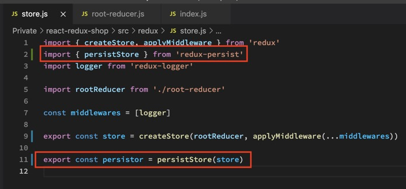
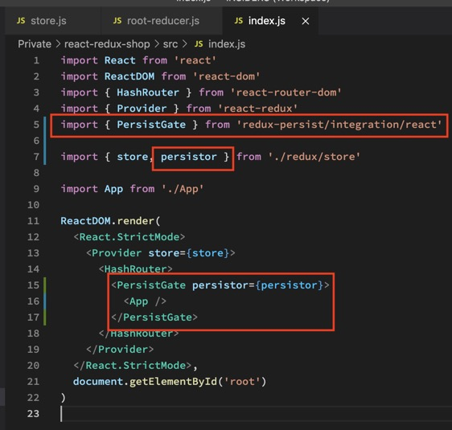
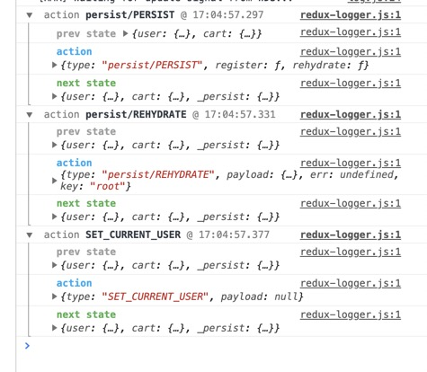

Der Unterschied zwischen window.localStorage und window.sessionStorage ist, wie lange Daten im Browser gespeichert werden. LOCAL speichert Daten solange bis man alle seine Browser Daten löscht. SESSION speichert sie solange man den TAB offen hat. Gespeichert werden können nur STRINGS.

Wir installieren also erst einmal redux-persist.

Wir erstellen eine PERSISTCONFIG in ROOTREDUCER JS, die sagt, welcher Reducer gespeichert werden soll. Wir brauchen das nur für den CART Reducer, nicht für den USER Reducer, da unser User von Firebase eh eingeloggt wird. Er ist also schon persistent. Dann wrappen wir PERSISTCONFIG und rootReducer in PERSISTREDUCER.

Auf Deutsch: Die Config sagt AB WO gespeichert werden soll (ROOT), mit welcher METHODE gespeichert werden soll (STORAGE) und WAS gespeichert werden soll (CART). Wir haben dem rootReducer, der in STORE JS zum STORE verarbeitet wird, also nur eine Config mitgegeben die sagt, WAS WIE persistet werden soll.

Wir erstellen dann den PERSISTOR mit PRESISTSTORE in unserer STORE JS.

Danach wrappen wir unsere App in PRESISTGATE.

Und wir sehen unser Redux Store gets rehydratet mit Cart Items wenn wir die Seite neu laden.

Wollen wir die Funktion wieder entfernen suchen wir einfach nur nach allem mit den Wort PERSIST.
