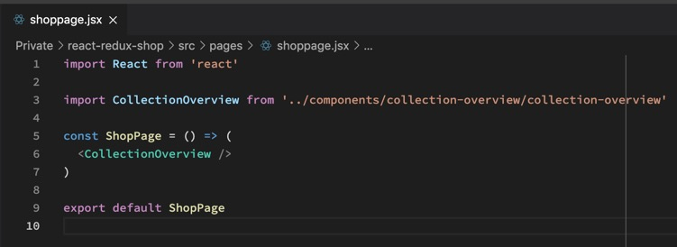
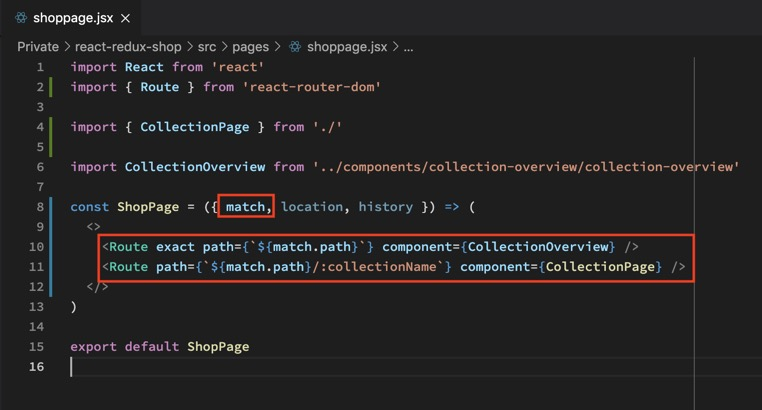
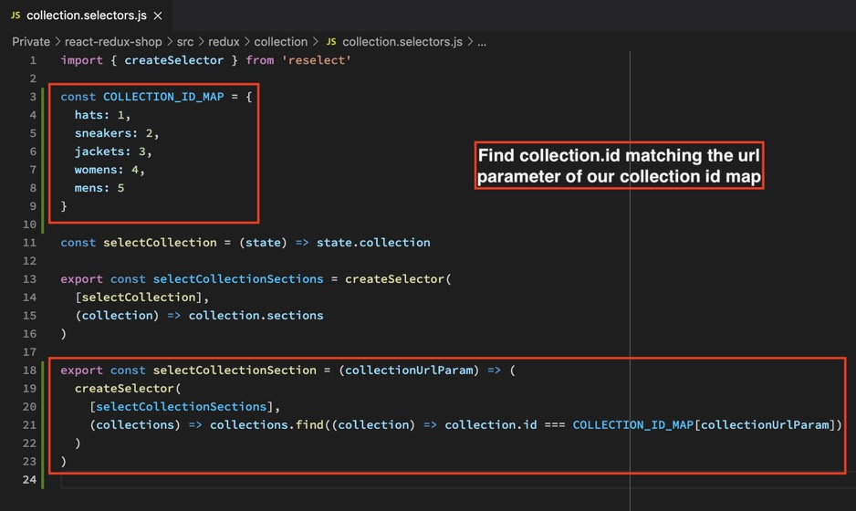
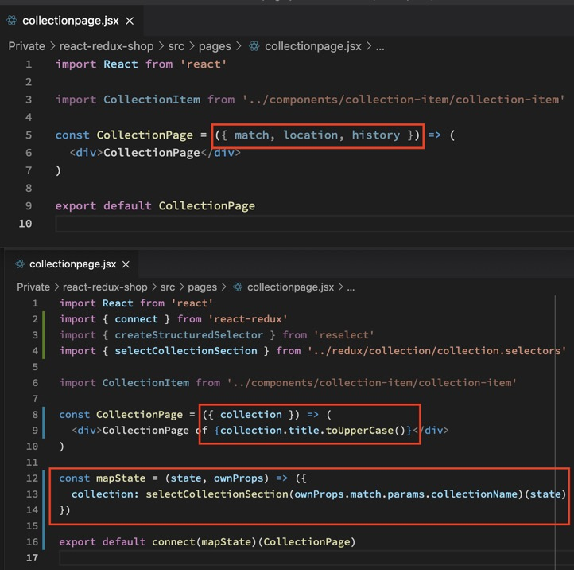
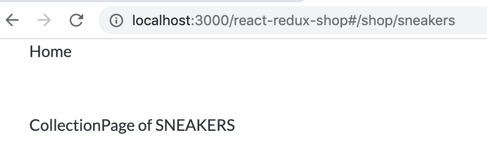
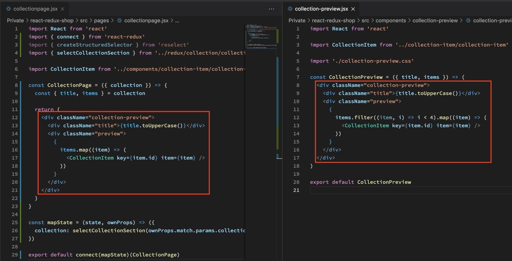
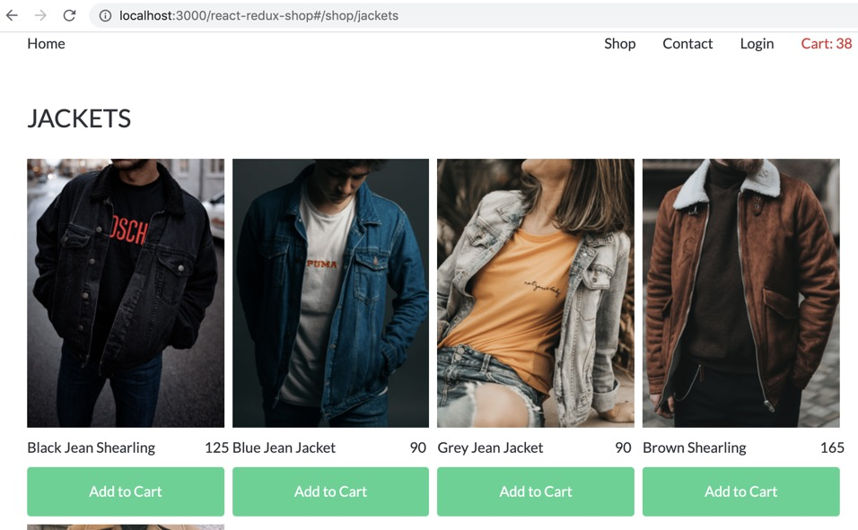

Jetzt wo die Shoppage keinen State mehr hat können wir sie entkernen indem wir das Mapping über die Collection in eine separate Component CollectionOVERVIEW verlagern.

Da wir nun eine leere Shoppage haben, ist der Weg frei für besseres Routing, denn im Moment führt die Homepage auf Kollektionsseiten die nicht existieren. Also erstellen wir eine COLLECTION page.

Jetzt können wir mit React Router zwischen CollectionOverview (die alte mit dem 4er-Filter) und CollectionPage (brandneu und aktuell leer) hin- und herwechseln, je nachdem was dem MATCH (/shop/) von der APP ROUTE für ein PARAMETER mit DOPPELPUNKT „:name“ angehängt wird.

Um das nun auf der CollectionPage korrekt anzuzeigen, schreiben wir einen SELECTOR in unseren Redux Ordner. Problem: Die IDs im JSON sind Ziffern. Der Path in der URL sind aber Strings. Das heißt, wir müssen sie ersteinmal gegeneinander MAPPEN. Dann suchen wir im Selector mit FIND danach und können per Selector darauf zugreifen.

Das heißt, geben wir nun den PATH vom MATCH in den SELECTOR, spuckt der nicht mehr den PATH, sondern die ID im JSON aus.

Das heißt, wir können den SELECTOR jetzt auf unserer CollectionPage nutzen, da dort ja der PATH über die MATCH PROPS reinkommt.

VORHER NACHHER CODE

match, location history haben wir durch den zweiten, optionalen parameter in MAPSTATE ersetzt: OWNPROPS. Die OWNPROPS (inkl den URL PATH), geben wir in unseren SELECTOR, der das korrekte Objekt aus der Json ausspuckt.

NOTE: Aufgrund der dynamischen URL ist der Slector nicht MEMOIZED. Abhilfe schaffen hier Libs wie lodash.memoize.

Jetzt können wir die tatsächliche Shop Unterseite bauen. Sie ist identisch mit der Shop Preview Seite, nur diesmal wird nicht für 4 Items gefiltert sondern einfach alle angezeigt.

