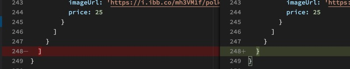
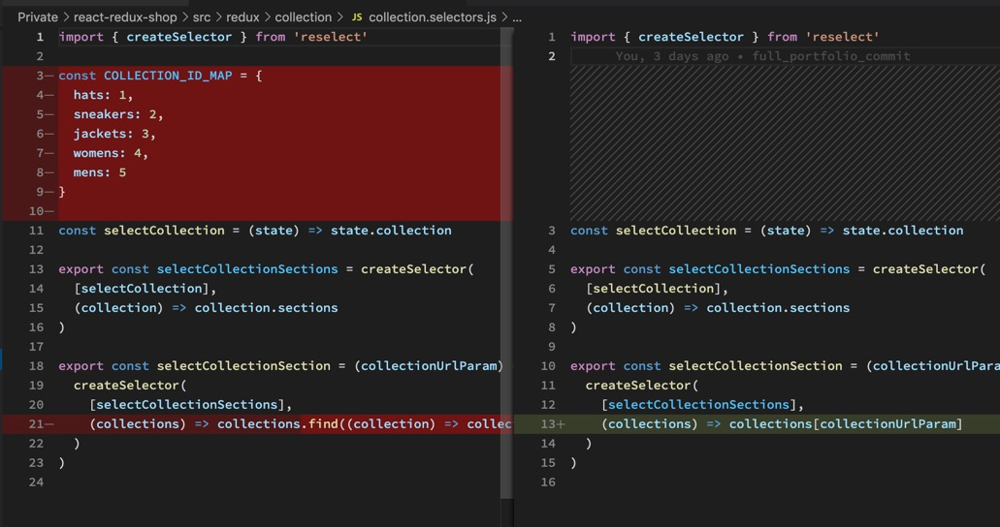

Das Problem mit unserem Object Mapping ist, dass es bei 5 Einträgen kein Problem darstellt, bei 100.000 aber schon.

Siehe: Hashtables vs Arrays

https://www.kirupa.com/html5/hashtables_vs_arrays.htm

Statt durch 100.000 Objekte zu filtern (was Zeit kostet), können wir das Objekt aber auch einfach umschreiben.

Dazu gibt es hier eine nützliche UTIL Function:

https://dev.to/danielpdev/normalize-your-complex-js-objects-21d9

Für unseren Code werden wir allerdings das Objekt selbst verändern.

Jetzt kann auch unsere teure Mapping Function weg.

Jetzt brauchen wir noch einen Selector, der das Objekt wieder in einem Array verwandelt, damit wir im Frontend später noch darüber Mappen können.

