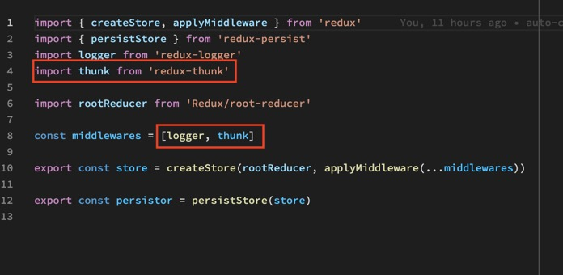
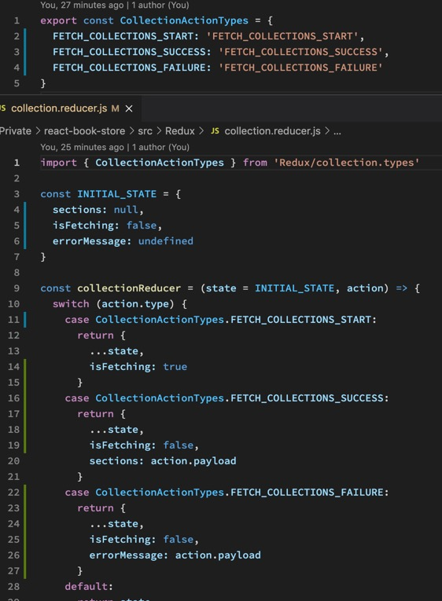
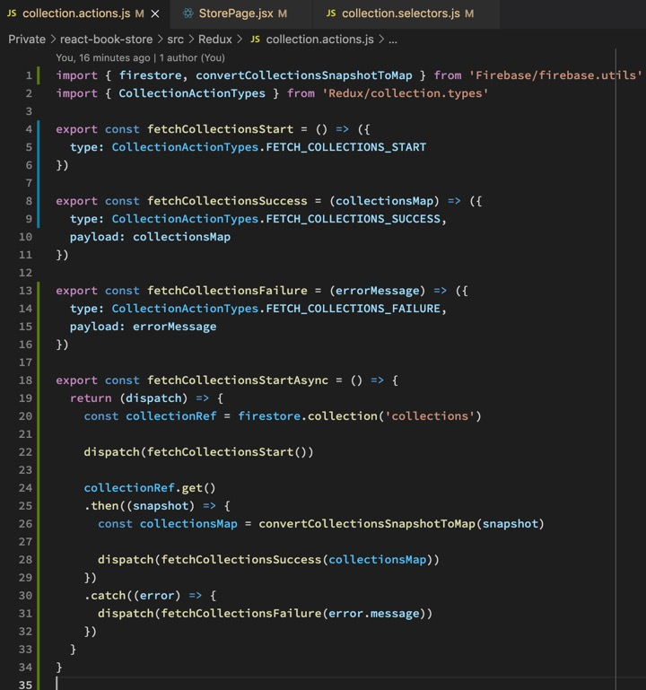
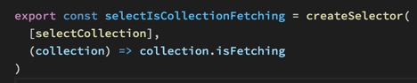
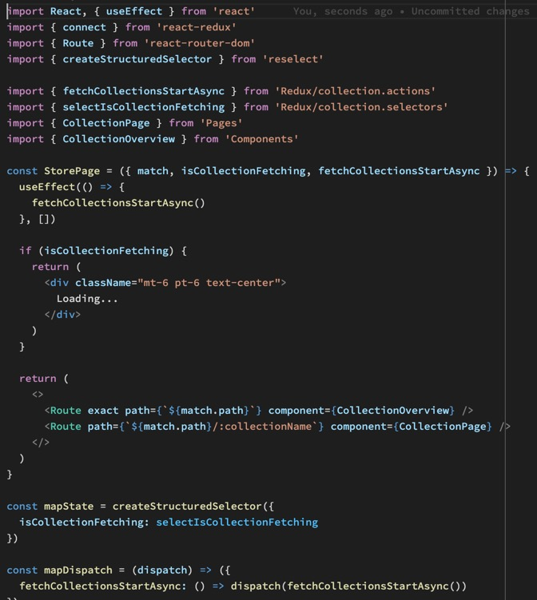
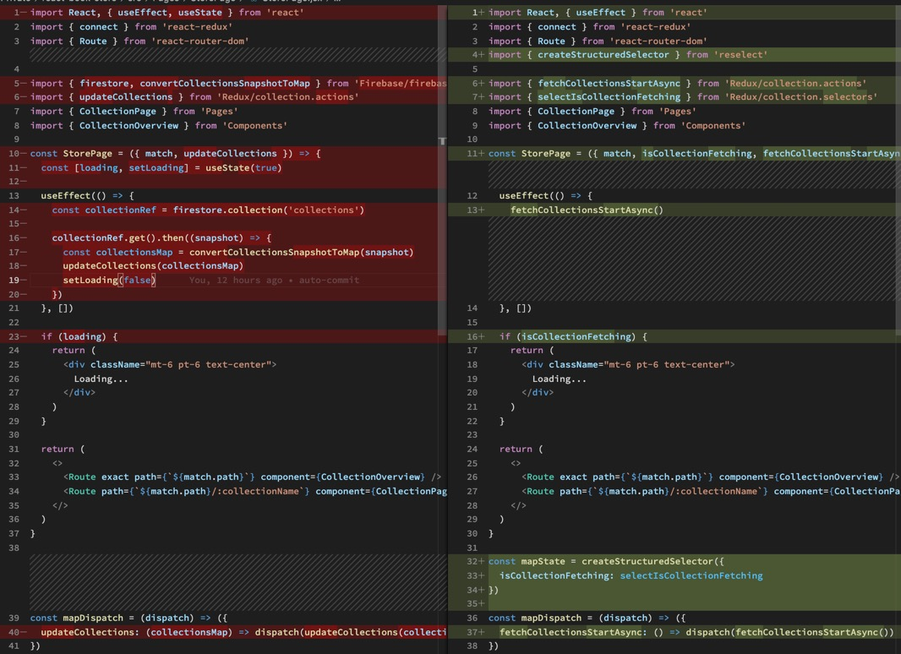
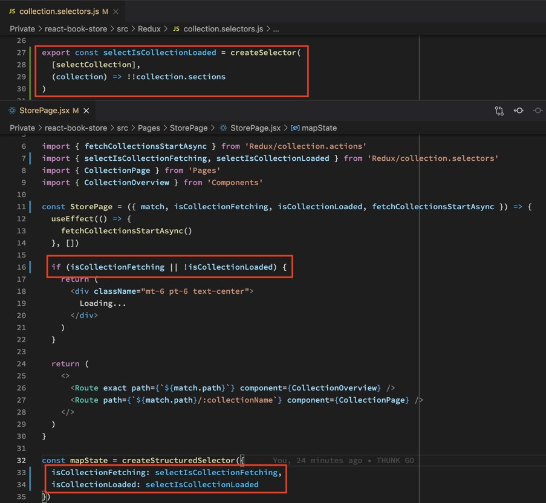

Mittlerweile ist unsere JSON Datei in Firebase gespeichert und wird per GET Request gefetched. Es gibt einen Loading State. Das gesamte Projekt ist auf Hooks umgestellt, unsere Pfade sind absolut und alle Redux-Dateien lose im Redux-Ordner.

Das letzte Ziel ist nun das Fetching mit Redux zu regeln. Mit Hilfe von REDUX THUNK.

Nach der Installation wird Thunk erst einmal dem STORE hinzugefügt.

Nun brauchen wir verschiedene TYPES die alle im REDUCER abgefragt werden.

Für all diese TYPES schreiben wir ACTIONS.

Mit Hilfe eines weiteren kleinen SELECTORS...

...können wir nun die Shop Page auf THUNK umbauen.

Die Änderungen der Shop Page in der Übersicht:

Der Shop funktioniert fast vollständig, nur ein Reload auf /shop/category/ schlägt noch fehl, weil hier Werte erwartet werden die es beim rendern noch nicht gibt.

Wir schreiben hierfür einen neuen SELECTOR den wir mit in unsere LOADING Abfrage nehmen.

