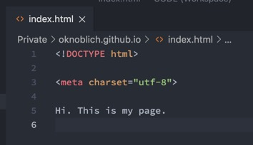

Als erstes wird natürlich ein GitHub Account benötigt. Die Registrierung ist noch das schwerste am ganzen Prozess. Der rest ist dank GitHub Pages super einfach. Zu erst einmal erstellen wir ein neues Repository.

Dieses bekommt den exakten Namen des Users + github.io - also in diesem Fall oknoblich.github.io

Dann brauchen wir eine INDEX page. Diese erstellen wir einfach in HTML. Wusstest du, dass in HTML fast alles optional ist? Sogar html, head und body? Alles was wir brauchen um zu starten sind diese 3 Zeilen.

Diese Page pushen wie jetzt gemäß der in Github angezeigten Anleitung.

Und schon ist sie da.

Und die Seite automatisch live. Der Prozess dauerte nichtmal 5 Minuten.

Jetzt wollen wir auf diesem Portfolio all unsere Projekte hosten. Theoretisch könnten wir nun einfach haufenweise Subfolder im Repo anlegen. Für jedes Projekt ein neuer Folder. Das macht aber a) das Repo ziemlich voll und b) kann man dann keine Projekte einzeln clonen oder forken. Also erstellen wir für jedes Projekt ein neues Repo. Jetzt müssen wir das nur in unser Portfolio bekommen.

Nehmen wir an wir bauen einen alten Klassiker, die React Todo Liste. Also erstellen wir wie im ersten Schritt erstmal ein Repo und pushen eine INDEX Datei.

Jetzt müssen wir GitHub mitteilen, dass wir das gerne in unserem Portfolio hätten. Dazu gehen wir auf SETTINGS und zu Github Pages. Dort selektieren wir unseren MAIN branch.

Und fertig. Nun ist auch unser Projekt auf dem Portfolio: https://oknoblich.github.io/react-todo-list/

Jetzt können wir beide Seiten noch miteinander verlinken.

Und schon können wir hin- und her navigieren: https://oknoblich.github.io/

