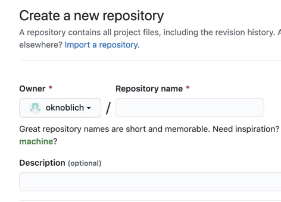

Unsere Projekte werden mit Sicherheit alle verschieden aussehen. Aber was, wenn wir ihnen einen einheitlichen Header und Footer geben wollen, um zwischen den einzelnen Projekten hin- und her zu navigieren? In jedem Repo die gleiche CSS Datei wäre redundant. Also erstellen wir erstmal ein neues Repo für ein Mini Design System.

Wir möchten eine schöne einheitliche Schriftart, also besuchen wir https://fonts.google.com/ und wählen eine aus. Wie wäre es mit Rubik?

Wir binden sie in eine frische CSS Datei ein und möchten nebenbei, dass unsere Links alle grün sind.

Das pushen wir jetzt in unser neues Repository.

Da GitHub selbst nicht als Hosting Service für statische Dateien funktionieren möchte, können wir externe Services wie https://raw.githack.com/ nutzen um über Umwegen unsere CSS Datei an verschiedene Projekte auszuliefern. Keine Long Term Lösung, aber für den Anfang reichts. Nebenbei können wir noch eine Überschrift hinzufügen.

Schon haben beide Projekte das gleiche CSS aus einem externen Repository.

Was wenn wir nun etwas ändern wollen? Wir müssten erst einmal den Link auf das CDN ändern, also auf unseren lokalen Ordner verlinken, und bei jedem Commit daran denken ihn wieder zu switchen. Unpraktisch. Bis wir also ein fertiges Design System haben, können wir uns mit einer Weiche helfen. Wir checken, ob unsere URL HTTPS enthält. Falls ja, verlinke auf die live Version, falls nein, verlinke lokal.

Ist das elegant? Nein. Aber es ist ein nützlicher Hack der uns am Anfang hilft nicht ständig etwas zu vergessen oder wechseln zu müssen. Erst recht, da gerade am Anfang die meisten Änderungen kommen.

Und fertig: https://oknoblich.github.io/

Was haben wir geschafft? Wir haben ein Portfolio mit GitHub Pages deployed, verschiedene Projekte über GitHub Projects aktiviert und einen Weg gefunden unser eigenes Design System von einem weiteren Repository hinzuzufügen, dass live und lokal funktioniert. Einzige Vorraussetzung ist, dass das Design System lokal immer ausgecheckt ist.

