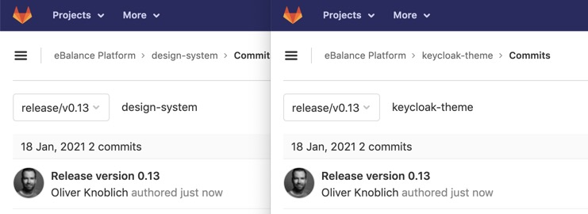
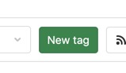
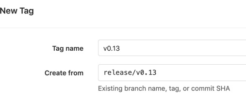
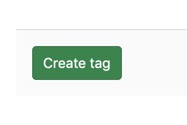
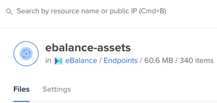
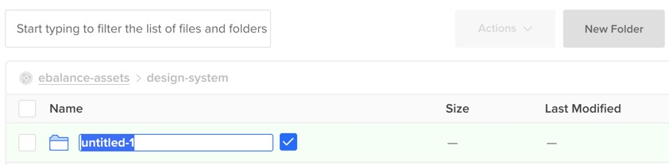
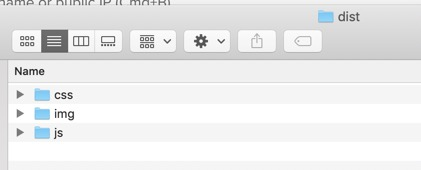
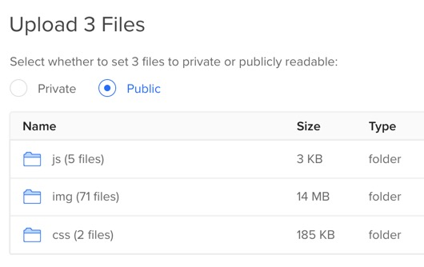
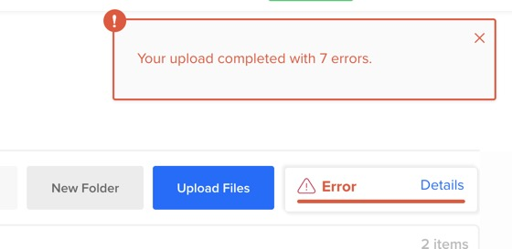
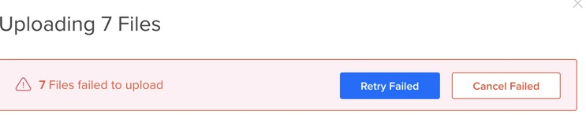

Ausgangslage:

* wir releasen v13
* MASTER in Keycloak / Design System ist zu 100% fertig und ready to go
* einen DEVELOP gibt es nicht

Wir führen also einen Release mit dem SIMPLE BRANCHING MODEL durch, ohne Patch Number und ohne RCs.

* wir erstellen in beiden Repos einen neuen BRANCH von MASTER mit git checkout -b release/v0.13 - OHNE .0 am Ende
* wir pushen den Branch
* wir ändern die Version in einem Release Commit "Release version 0.13"
* wir pushen den Branch

Wir gehen in beiden Repos auf TAGS und erstellen einen neuen TAG namens v0.13 vom Release Branch als Quelle.

Die Tags sind nun fertig:

Nun müssen wir die statischen Dateien im CDN releasen. Wir gehen zu Digital Ocean und klicken aus SPACES und DIGITAL ASSETS und DESIGN SYSTEM.

Hier erstellen wir einen neuen Ordner namens v0.13

In diesen ziehen wir alle statischen Dateien aus dem DS DIST Ordner.

Und markieren sie als PUBLIC.

Hier tauchen regelmäßig FEHLER auf.

Ist aber kein Problem, wir könnten einfach auf RETRY drücken.

Und der Release ist abgeschlossen.
