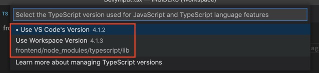

Öffnet man eine JSX Datei, bekommt man von VSCode die Version angezeigt. Die kann sich von der im Projekt genutzten aber unterscheiden und das kann zu Problemen führen.

In einer frischen VSCode Installation bekommen wir 4.1.2 angezeigt.

Um die aus dem Projekt zu nutzen klicken wir darauf. Ein Fenster öffnet sich.

Wir klicken auf Select Version und dann auf die, die im Frontend installiert ist: 4.1.3

Schon nutzen wir die vom Projekt statt vom Editor.

Dieses Setting wird in eurem Workspace gespeichert, nicht in euren VSCode Settings.

