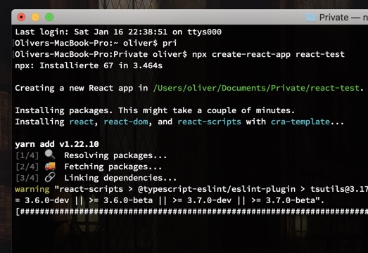
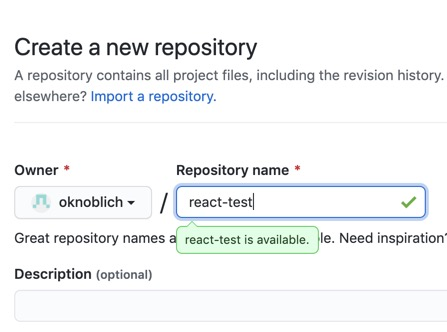
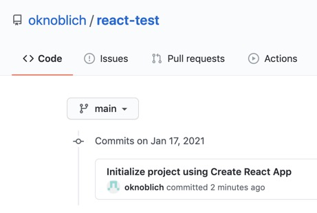
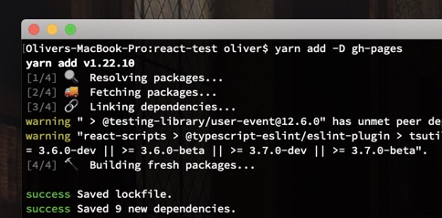
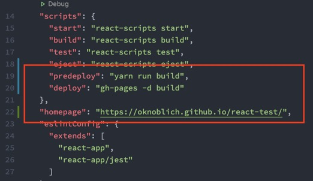
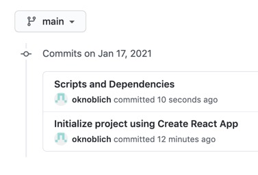
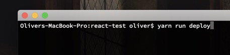
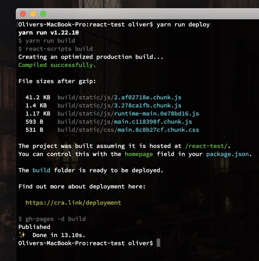
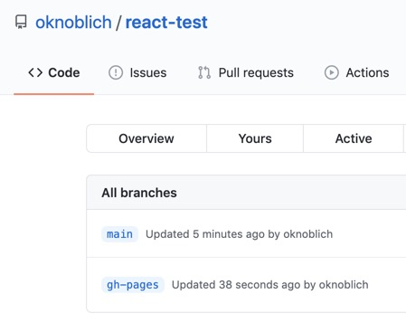
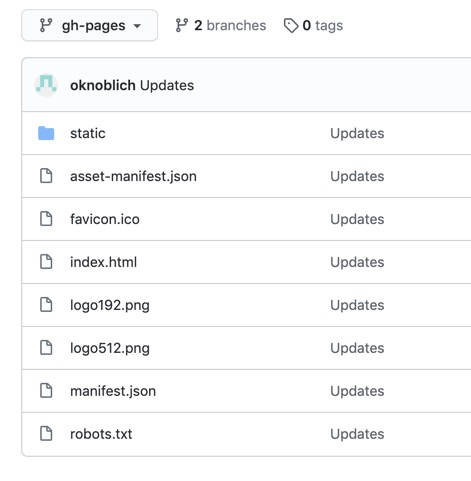

Zuerst einmal brauche wir dafür eine React App. CRA ist der populärste Weg eine React App zu starten: npx create-react-app react-test - das erzeugt zwar viel Boilerplate und einiges dass wir eh löschen / nicht brauchen, aber für den Anfang ist es gut einen Startpunkt zu haben. Später, wenn wir mehr wissen, reicht eine einzelne package.json.

Wir pushen das Projekt in ein neues Repository. Die Commit Message gibt CRA selbst vor.

Würden wir jetzt Pages aktivieren, würde nichts passieren. Wir brauchen einen BUILD. Aber selbst der würde nicht reichen unsere Seite zu aktivieren. Wir brauchen eine weitere dev dependencie: gh-pages.

Nun benötigen wir ein paar Anpassungen an der package.json. Wir fügen zwei Scripte und eine homepage hinzu.

Wir pushen die Änderungen.

Die HOMEPAGE sagt dem Bundler, dass wir hier ein GITHUB PROJECT deployen wollen. Es also in einem Unterverzeichnis liegen wird, nicht direkt auf /. Würde die React App stattdessen auf username.github.io direkt liegen, bräuchten wir diese Angabe nicht.

PREDEPLOY erstellt unseren Build. DEPLOY ruft gh-pages auf den Plan und erstellt einen neuen Branch in unseren Repo, gh-pages genannt. In diesen wird ausschließlich der Build kopiert und anschließend von GitHub automatisch aktiviert.

PREDEPLOY wird automatisch mitaufgerufen wenn wir DEPLOY starten (entnommen der CRA Dokumentation). Testen wir das ganze einmal.

10 Sekunden später, alles fertig.

