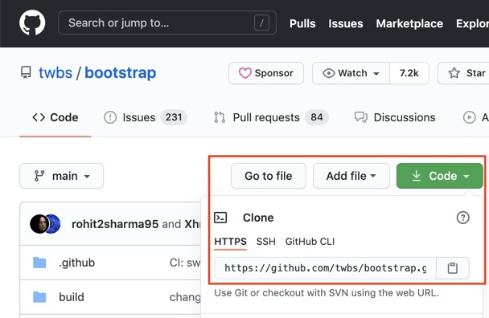
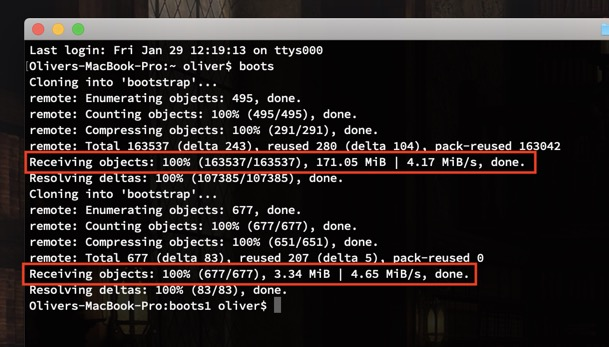
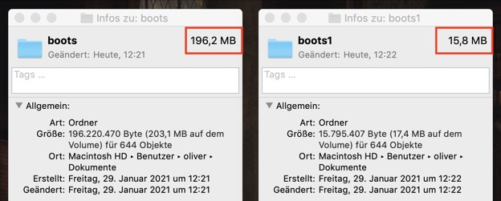
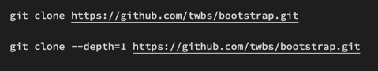

Bei einem GIT CLONE werden alle Dateien auf den Rechner geladen die in diesem Repo je existiert haben. Das kann erhebliche Unterschiede bei der Downloadgeschwindigkeit machen.

Dies lässt sich mit der Flag --depth=1 verhindern.

Vergleichen wir die beiden Prozesse einmal. Nehmen wir als Beispiel an, wir wollen Bootstrap clonen.

Wie man sehen kann gibt es einen großen Unterschied bei den Objekten die vom Server geladen werden.

163.000 vs 670 Objekte

Auch beim Ordner auf der Festplatte lässt sich dieser Unterschied feststellen.

196 vs 15 Megabyte

Hier die beiden Befehle zum Vergleich.

