## [Shop 1] App erstellen und mit Components strukturieren

Am Anfang starten wir Create React App.

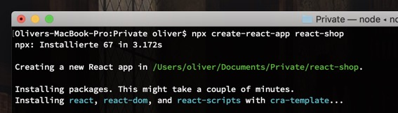

Wir entfernen das HTML und CSS dass von CRA erstellt wurde und starten frisch.

Dann erstellen wir eine Homepage Component und bauen darin erstmal eine Shop Einstiegsseite. Basic HTML und CSS innerhalb einer Functional Component.

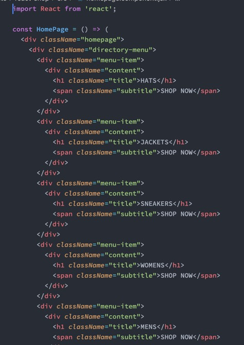

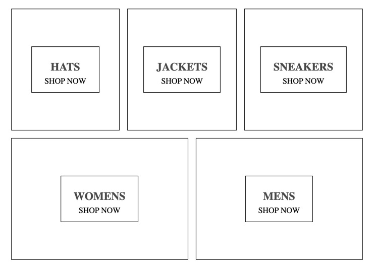

Jetzt unterteilen wir das Projekt in COMPONENTS und PAGES, denn wir wollen nicht alles in eine einzige Datei werfen. Dabei achten wir darauf, Parent und Child Components sowie ihre CSS Dateien korrekt zu exportieren und zu importieren. Außerdem erstellen wir unseren ersten STATE mit einem Array aus Shopping Kategorien.

Das aktuelle Ergebnis:

Damit wir das jetzt auf GitHub Pages bekommen, installieren wir wieder das gh-pages package und die dazugehörigen Scripts.

Nachdem wir wieder YARN RUN DEPLOY ausgeführt haben, ist die Seite auch schon live: https://oknoblich.github.io/react-redux-shop/

## [Shop 2] React Router, Form Components, Input State

Wir installieren react-router-dom.

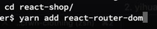

Wir importieren BrowserRouter und wrappen die gesamte App darum.

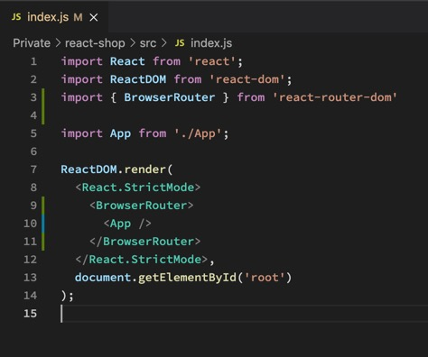

Wir importieren Switch und Route und nutzen es um zwischen Pages zu navigieren.

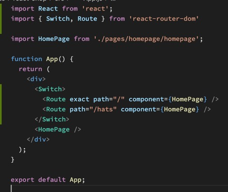

Damit wir kein Prop Drilling veranstalten müssen und trotzdem alle Childs Zugang zum Router haben, importieren wie withRouter wo wir es brauchen und exportieren die Component damit.

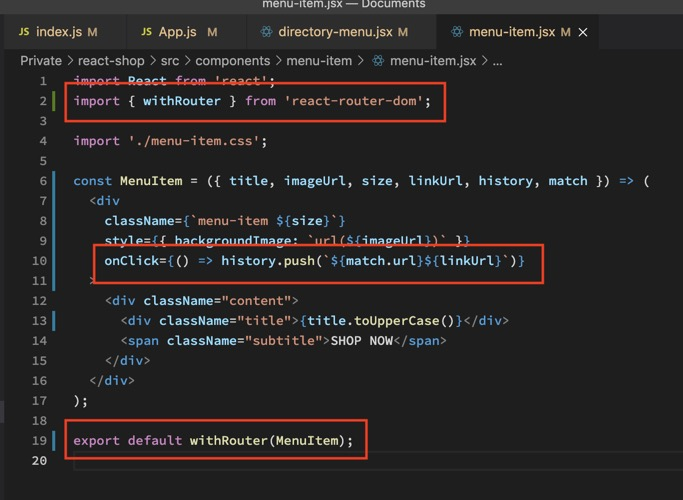

Wir erstellen eine Shop Page und verlinken sie im Router.

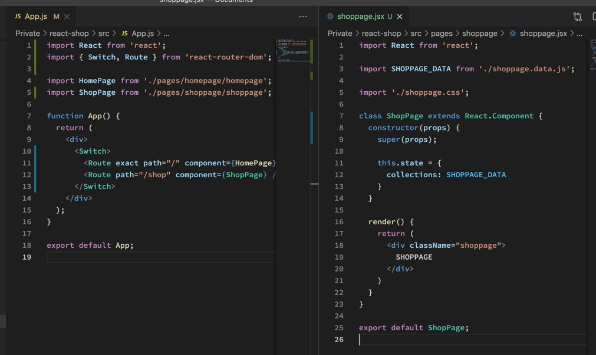

Dann erstellen wir eine CategoryPreview Component und mappen sie auf unserer Shop Page.

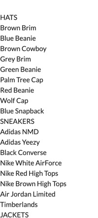

Wir wollen aber nur 4.

Wir erstellen eine Header Component und weitere Unterseiten, zwischen denen wir mit dem Header navigieren können.

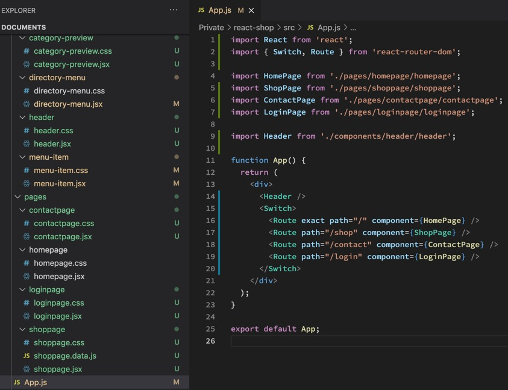

Wir erstellen ein Login Formular und handlen schon einmal ein wenig den State. Bei Änderungen wird der Value live in den State geschrieben, beim Submit des Forms wird der State, und somit auch die Inputs, geleert.

Daraus machen wir nun eine Form Input Component und eine Button Component.

Console Log zeigt uns, unsere Components funktionieren wie sie sollen.

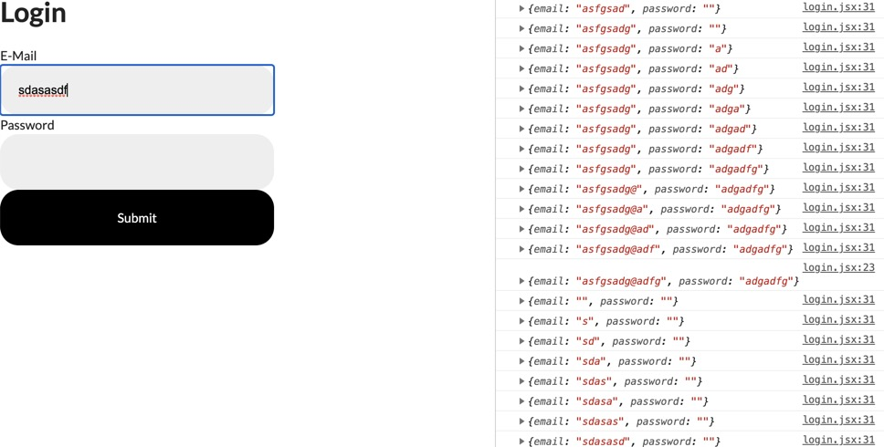

Wir pushen alles zu GitHub und rufen wieder gh-pages DEPLOY auf den Plan.

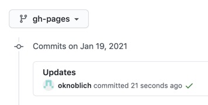

Die Navigation läuft aber nicht, da im Gegensatz zu localhost die App nun hinter /react-redux-shop/ liegt. Abhilfe schaffen wir uns, indem wir den BrowserRouter mit HashRouter ersetzen.

Nun läuft die App im /#/ Mode und wir können auch auf GitHub Pages navigieren.

## [Shop 3] Backend Anbindung und Login/Logout mit Firebase Authentifizierung

Wir besuchen die Firebase Console auf https://console.firebase.google.com/ und erstellen ein neues Projekt.

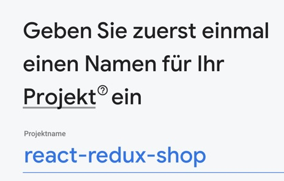

Wir fügen Firebase zu unserer App hinzu.

Wir fügen Firebase zu unserem Projekt hinzu.

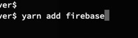

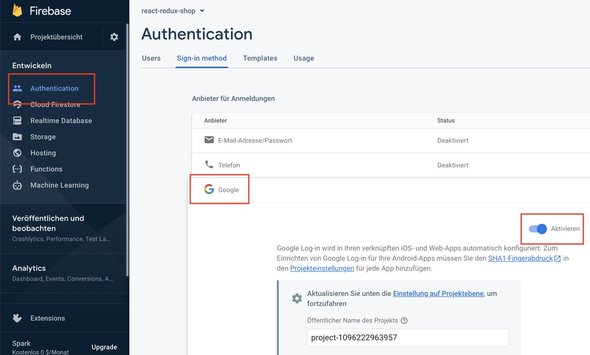

Und schon ist der Google Login fertig.

Wir fügen nun einen State zur App hinzu, der uns sagt ob der User ein- oder ausgeloggt ist.

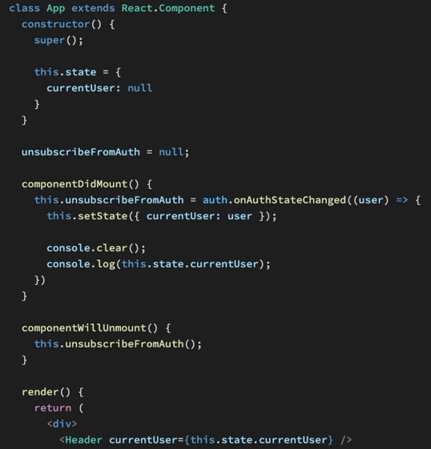

Und am Ende noch einen Logout Button in den Header.

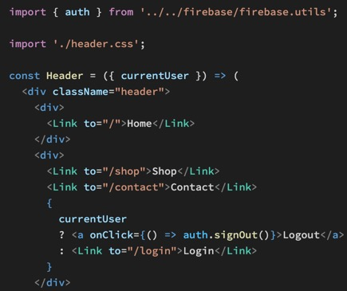

Und dann fügen wir noch unsere GitHub URL ins Firebase Backend ein, damit Firebase weiß die URL ist erlaubt.

## [Shop 4] BE DB erstellen, User in DB, DB Eintrag in den State

Als erstes erstellen wir eine Datenbank in der Cloud.

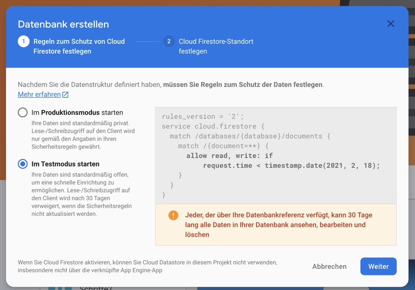

Dann sorgen wir dafür dass unsere App einen neuen User in unsere neue Datenbank schreibt.

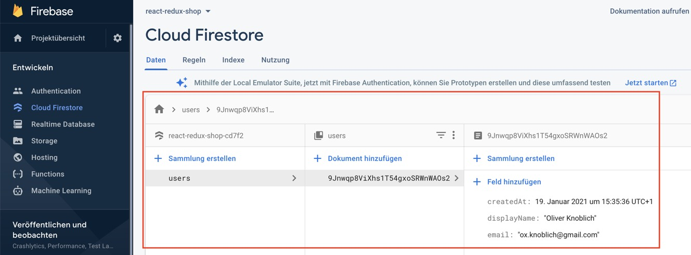

Dann entfernen wir das Timelimit aus der Datenbank, damit in 4 Wochen noch alles funktioniert.

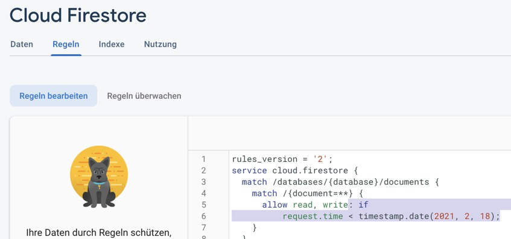

Dann sorgen wir dafür dass der eingeloggte User auch in unserem State landet.

## [Shop 5] E-Mail-Registrierung

In JSX erstellen wir ein Registrierungsformular inkl State Handling. Der Großteil der Arbeit ist bereits erledigt, das heißt alles was wir brauchen ist eine Datei die auf vergangenes aufbaut.

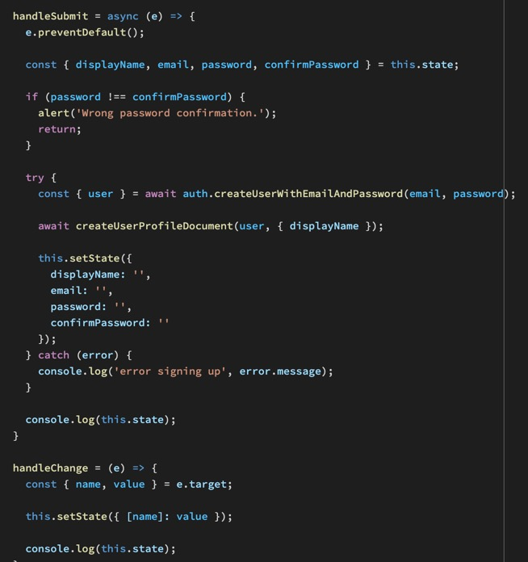

In Firebase muss Email/Passwort aktiviert werden.

Und schon funktioniert unsere Registrierung mit Email Adresse.

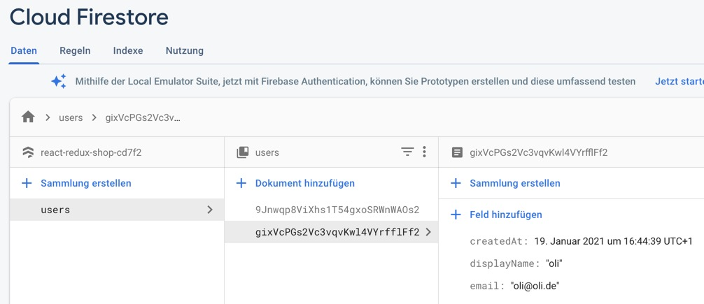

Wenige Zeilen in der Login Component später können wir uns mit diesen Daten auch einloggen.

Fertig. Wir haben eine komplett funktionierende Registrierung mit E-Mail und einen Login mit E-Mail und Google.

https://oknoblich.github.io/react-redux-shop/#/login

## [Shop 6] Redux Intro

REDUX ersetzt THIS STATE und macht STATE in REACT generell SKALIERBARER.

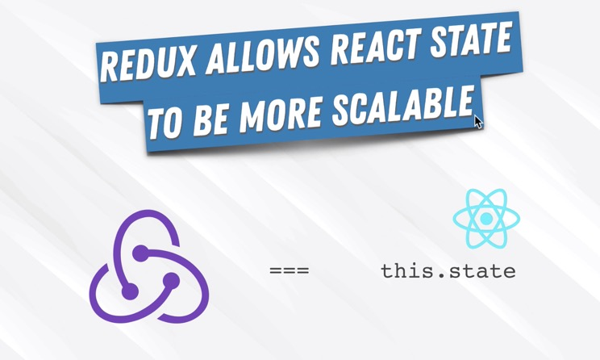

Der Flow of Data wird immer unübersichtlicher je größer die App wird.

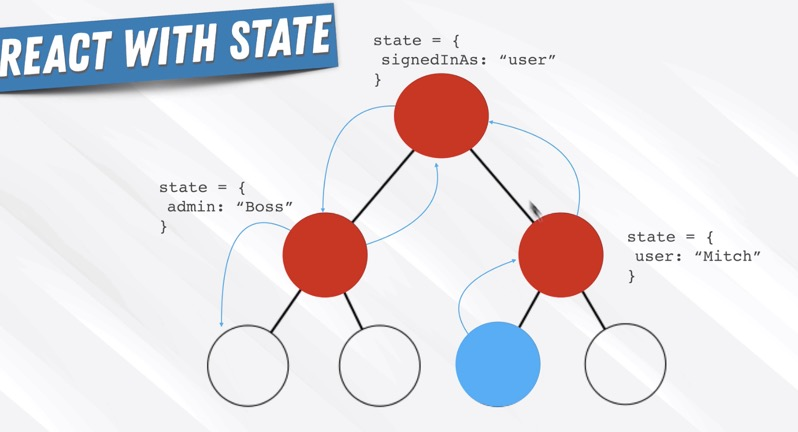

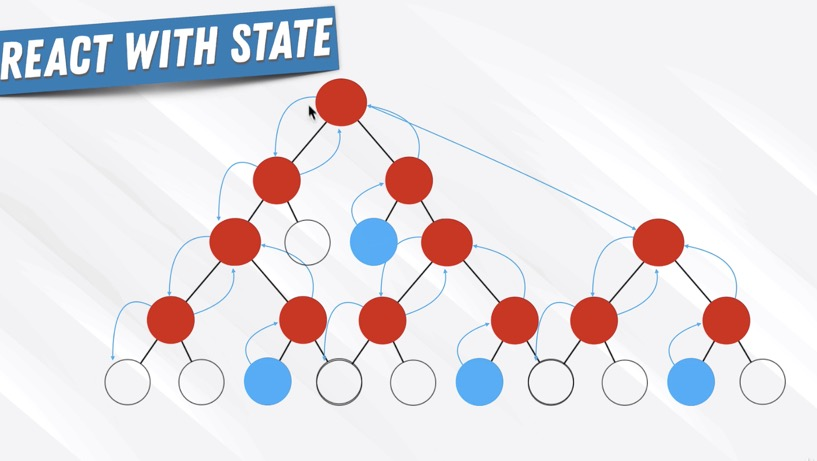

Redux tritt an um dieses Problem zu lösen.

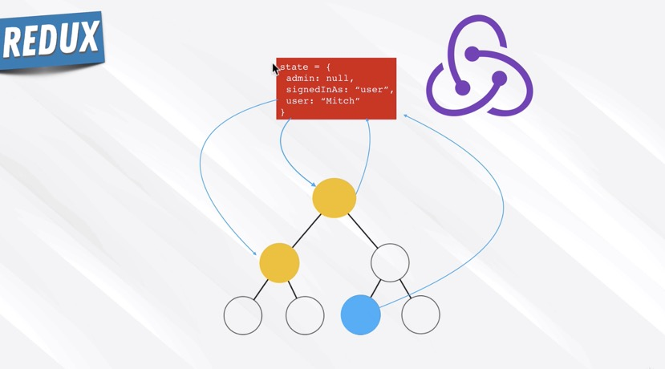

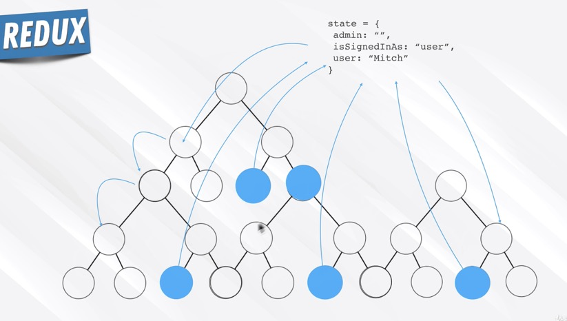

Der FLUX Pattern von Redux ersetzt den klassischen MVC Pattern.

Redux will PROP DRILLING verhindern.

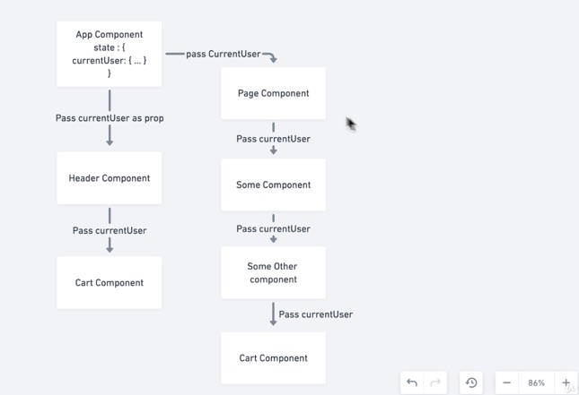

Components triggern ACTIONS die wiederum REDUCER triggern. Diese schreiben einen globalen State der wiederum zurück zu den Components geleitet wird. Unidirectional Data Flow.

Eselsbrücken:

Ein App besteht aus Functions, nennen wir sie ANGESTELLTE. Wenn der User im UI rumklickt, erteilt er verschiedenen ANGESTELLTEN verschiedene Aufgaben. Ein Chaos entsteht, alle rennen rum, machen was sie wollen. REDUX, der BOSS, will dies ändern. Er führt REDUCER ein (die selbst nichts weiter als Functions sind). REDUCER sind ABTEILUNGSLEITER Functions. Klickt der User im UI rum, gehen die Aufgaben an die ABTEILUNGSLEITER, die erstmal prüfen ob überhaupt eine Änderung stattgefunden hat. Wenn nicht, machen sie nichts. Wenn doch, leiten die ABTEILUNGSLEITER die Änderungen hübsch verpackt an den ROOT REDUCER weiter (die rechte Hand vom BOSS). Nur der ROOT REDUCER führt nun die Änderungen im UI durch. Die ANGESTELLTEN machen gar nichts mehr im UI.

JEDE Aktion in der UI wird an ALLE Reducer gesendet. Ein Reducer ist nicht weiter als eine Function. Es nimmt den aktuellen State und eine Action. Checkt, ob diese Action irgendwas mit einer eigenen Abteilung zu tun hat. Wenn ja, stelle einen neuen State her (der alte State kann nicht verändert werden, er ist immutable), wenn nein, gib den State im Original zurück.

In diesen Prozess können wir eine MIDDLEWARE einbauen. Ein Sekretariat, welches die Action noch vor dem Abteilungsleiter bekommt.

Um Redux zum Laufen zu bekommen müssen wir mehrere Dinge in unsere App installieren: REDUX selbst, REACTREDUX, da Redux nicht nur mit React verwendet werden kann, und REDUXLOGGER als unsere erste Middleware.

Danach brauchen wir den PROVIDER in der index.js. Die Elternkomponente unsere gesamten App.

Dann schreiben wir als erstes unseren ersten REDUCER (den ersten Abteiliungsleiter).

Und als zweites unseren ROOT REDUCER (die rechte Hand vom Boss) der alle Reducer kombiniert.

Jetzt müssen wir unsere STATE noch irgendwo hin packen damit der PROVIDER (in der index.js) ihn verteilen kann. Wir erstellen dazu einen STORE mit dem Ergebnis unseres ROOTREDUCERS und allen MIDDLEWARES die wir noch in den Mix packen wollen.

Jetzt bekommt der Provider endlich unseren fertigen Store.

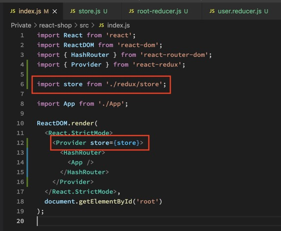

Am Ende fehlt noch ein finales Puzzlestück. Die Functions in unsere App (Mitarbeiter) müssen irgendwie mit den Reducern (Abteilungsleitern) kommunizieren. Dazu erstellen wir ACTIONS. Die Actions haben TYPE und PAYLOAD, genau die Dinge, die die Reducer bei ihrer Arbeit abfragen.

Unsere neue Ordnerstruktur:

RECAP

Um zukünftig mit dem STATE zu interagieren triggern wir ACTIONS. Diese ACTIONS werden an REDUCER übergeben, die die PAYLOAD in einen neuen STATE schreiben wenn der TYPE übereinstimmt. All die REDUCER schnappt sich der ROOT REDUCER, der mit COMBINEREDUCERS alle zu einem Objekt vereint. Dann erstellt CREATESTORE einen neuen STORE mit dem Inhalt des ROOTREDUCERS und aller benötigten MIDDLEWARES. Diesen STORE schnappt sich der PROVIDER und gibt ihn an unsere App.

## [Shop 7] mapState/mapDispatch (ToProps)

Jetzt müssen wir das ganze in unseren Components zum Laufen bekommen. Angefangen mit dem Header. Wir holen uns CONNECT und geben unserem Header mit MAPSTATETOPROPS Superpowers. Der STATE kommt nun nicht mehr von der Eltern-Component sondern von REDUX. Das heißt, wir können die Prop in App.js entfernen. Components können sich Props nun von der HOF CONNECT selber holen und sind nicht mehr auf ihre Eltern angewiesen. Prop Drilling erfolgreich verhindert. Wir LESEN nun den STATE von REDUX von wo auch immer wir wollen.

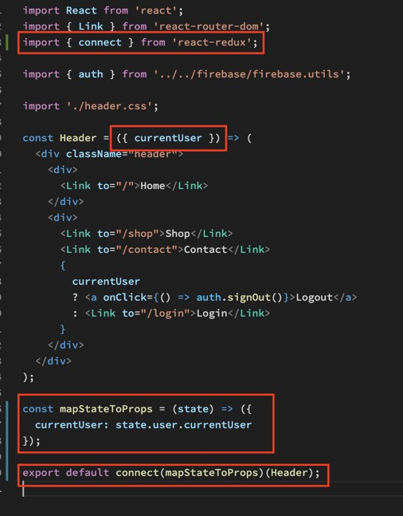

Jetzt müssen wir ihn noch SCHREIBEN können. Dazu holen wir uns CONNECT in die App und gleich noch unsere ACTION mit dazu. Dann verbinden wir das wie schon den Header mit MAPDISPATCHTOPROPS und können den STATE nun auch SCHREIBEN.

Ein Menge Setup und Boilerplate Code (der größte Kritikpunkt an Redux der regelmäßig auftaucht) aber es ermöglicht uns nun unseren ganzen SETSTATE Code mit einem einfach Function Call zu ersetzen.

Unsere MIDDLEWARE zeigt uns in der Console was passiert. Wir können also alle console.logs entfernen und sind immer up-to-date.

FAZIT: Unsere Components müssen nun nicht mehr miteinander kommunizieren, sie kommunizieren ab sofort nur noch mit Redux.

## [Shop 8] Toggle einrichten und (evtl. doppelte) Items hineinlegen

Um eingeloggt nicht auf den Login zuzugreifen, Redirecten wir auf Home:

Best Practice: Alle ActionTypes in einem Objekt versammeln:

Jetzt wollen wir einen Einkaufswagen bauen der toggelt. Das HTML (bzw JSX) und CSS sind wie immer schnell gemacht. Aber: REDUX AUCH. Denn wir haben fast alles schon einmal geschrieben. Das heißt, wir COPY-PASTEN unseren Redux User Ordner und ersetzen „user“ mit „cart“. Dann verteilen wir ACTION und MAPSTATETOPROPS an die Stellen die es brauchen (CartIcon und Header).

Schon toggelt unser Einkaufswagen.

Jetzt wollen wir Items hinzufügen, sobald wir im UI auf einen der „Add to Cart“ Buttons klicken. Dazu COPY-PASTEN wir vieles von unserem Redux Code und passen es so an, dass es ADD_ITEM triggert.

Jetzt müssen wir es nur noch in unseren CATEGORY ITEM hinzufügen und triggern, sobald man auf einen Button klickt.

Und schon landet das Object im Redux Store, wie man in der Konsole sehen kann.

Jetzt müssen wir dafür sorgen, dass doppelte ITEMs als das selbe Item hinzugefügt werden, nur in höherer Anzahl. Wir coden dazu eine UTIL Function.

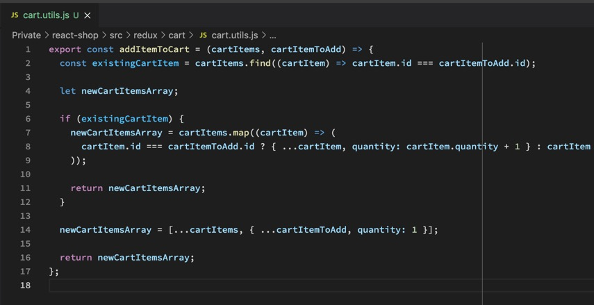

WAS PASSIERT HIER? Wir checken erstmal ob 2 übereinstimmende IDs gefunden werden. Wenn nein, gib den originalen Array zurück, füge aber das neue Items hinzu, und füge diesem neuen Item eine Quantity von 1 hinzu. Wenn ja, laufe alle Items einmal durch und checke welches doppelt ist. Wird eines gefunden, wird es aufgespreaded und die Quantity wird um eines erhöht.

Das verpacken wir jetzt in unserem Reducer:

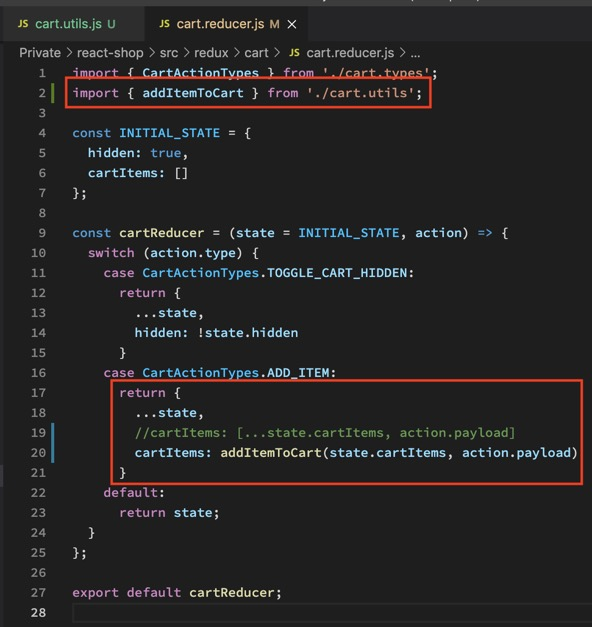

Und schon erhöht sich die Quantity.

Jetzt müssen wir nur noch den ITEM ARRAY aus dem REDUX STORE in unserem CART DROPDOWN anzeigen. Dazu editieren wir nur CART ITEM und CART DROPDOWN. Denn nur diese Compontents benötigen den REDUX STORE:

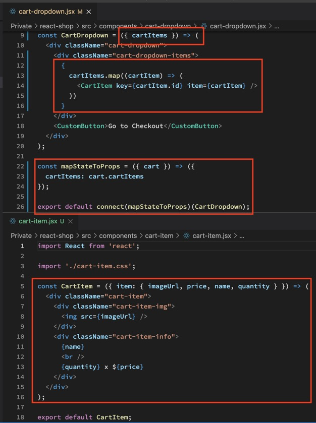

Um dem Counter die korrekte Anzahl an Items zu geben, nutzen wir REDUCE und addieren alle QUANTITIES zusammen.

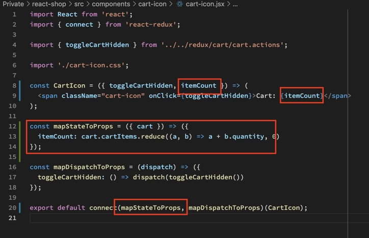

Und fertig ist der Shopping Cart.

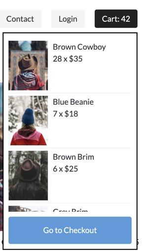

## [Shop 9] Memoization mit Reselect

Der gesamte Redux Store wird bei einem State Change neu geschrieben. Damit werden auch Component Rereders getriggert bei denen gar kein Update stattfand. Das geht bei sehr teuren Berechnungen zu Lasten der Performance. Hier kommt MEMOIZATION ins Spiel. Wir installieren hierfür RESELECT.

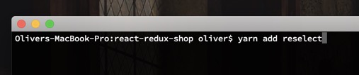

Mit RESELECT schreibt man SELECTOR FUNCTIONS. Diese nehmen den State als Argument und returnen etwas dass auf diesem State basiert. Hier eine sehr gute Erklärung von einem der aktuellen Redux Maintainer:

Idiomatic Redux: Using Reselect Selectors for Encapsulation and Performance https://blog.isquaredsoftware.com/2017/12/idiomatic-redux-using-reselect-selectors/

Selector Functions können jeden Namen haben, aber normalerweise beginnen sie mit GET oder SELECT. Sie akzepieren zwei Arguments, eine Reihe von INPUT SELECTORS und eine OUTPUT SELECTOR FUNCTION. In dieser Function kann man machen was man will. Am Ende returned createSelector() IMMER eine neue FUNCTION.

In Code dargestellt:

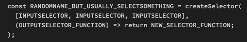

Werden die gleichen Argumente wie zuvor in eine Function gegeben, wird die teure Berechnung darin nicht erneut ausgeführt. Es wird sich an das Ergebnis „erinnert“.

In unserer Codebase sieht das nun so aus:

Der ItemCount, den wir per mapStateToProps in unsere Component als Prop geben, wird nun nichtmehr direkt an Ort und Stelle berechnet, sondern ruft eine Function importiert aus unseren Selectors auf. Diese führt die Operation aus, aber nur, wenn die Arguments anders sind als zuvor.

Das gleiche können wir nun im Dropdown machen, aber nicht mit dem Item Count, sondern mit den Items selbst.

Die Änderungen in GIT im Überblick:

FAZIT: Wir lesen den State nicht mehr direkt in der Component, sondern überlassen dass unseren verschiedenen Selektoren die wir im Redux Ordner geschrieben haben.

Jetzt können wir das gleiche im HEADER machen. Dort haben wir den USER und den HIDDEN boolean.

Damit wir jetzt nicht zig mal den STATE referieren müssen, holen wir uns CREATESTRUCTUREDSELECTOR. Damit können wir das ganze abkürzen:

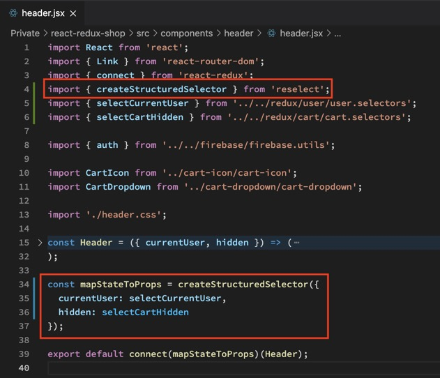

Unseer Code wird langsam aber sicher aufgeräumter und einfacher zu lesen. Jetzt übernehmen wir diesen Patteren für alle Components, und benutzen gleichzeitg auch überall CREATESTRUCTUREDSELECTOR.

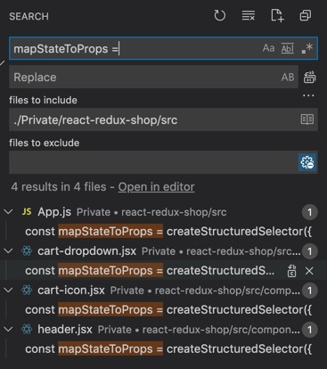

Die finalen Änderungen in GIT:

## [Shop 10] Checkout Page bauen und einzelne/alle Items entfernen

Für die Checkout Page müssen wir das Rad nicht neu erfinden. Wir wiederholen und copy-pasten viel von dem was wir bereits gelerent und gecodet haben.

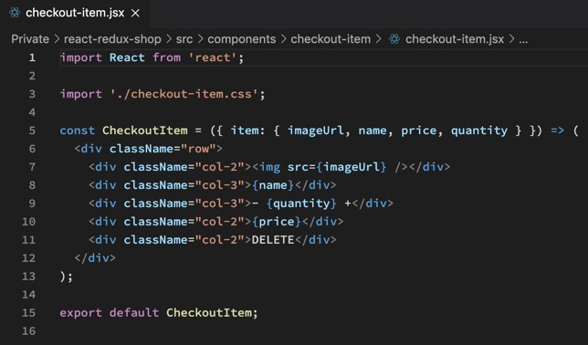

Jetzt schließen wir den Cart wenn man den Checkout öffnet.

Wir fügen eine CLEAR Function hinzu die Items, unabhängig von ihrer Anzahl, komplett entfernt.

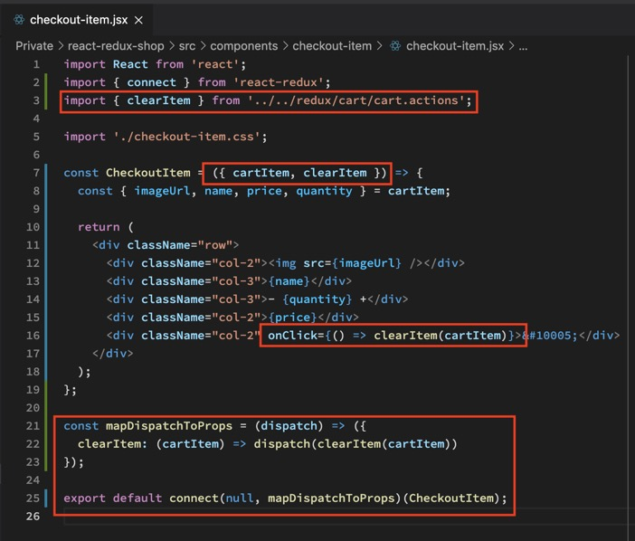

Am Ende kommt noch eine CLEAR ALL Function hinzu die alles löscht.

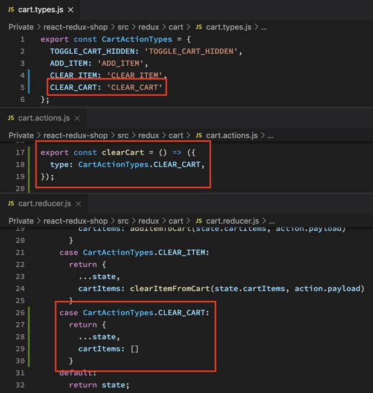

## [Shop 11] Anzahl verringern Funktion in Redux

ADD ITEM und CLEAR ITEM hatten eine klare Aufgabe. Ein Item hinzufügen oder ein Item komplett entfernen. REMOVE ITEM kann jedoch verschiedene Dinge aufrufen. Ich kann die Anzahl verringern wenn ich mehrere Items habe ODER das Item komplett entfernen wenn ich nur eines habe und dann REMOVE klicke.

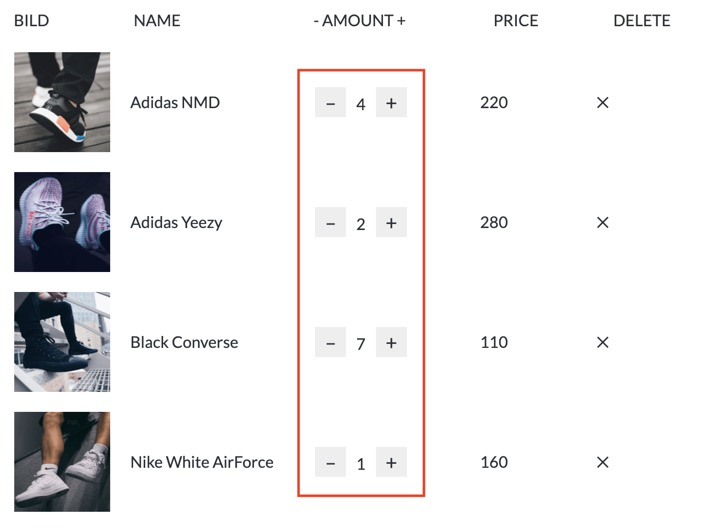

Dazu müssen wir nichts weiter tun als die beiden bereits geschriebenen Funktionen zu vereinen und abzufragen, ob EIN Item im Cart liegt oder nicht.

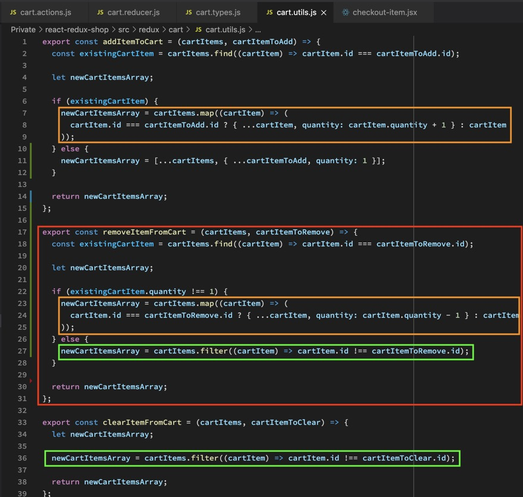

Der Rest ist Redux Business as usual:

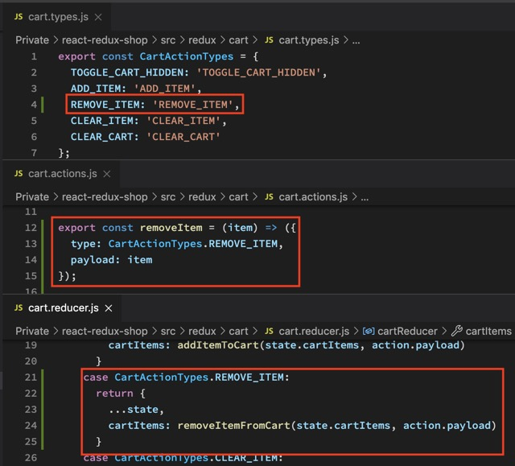

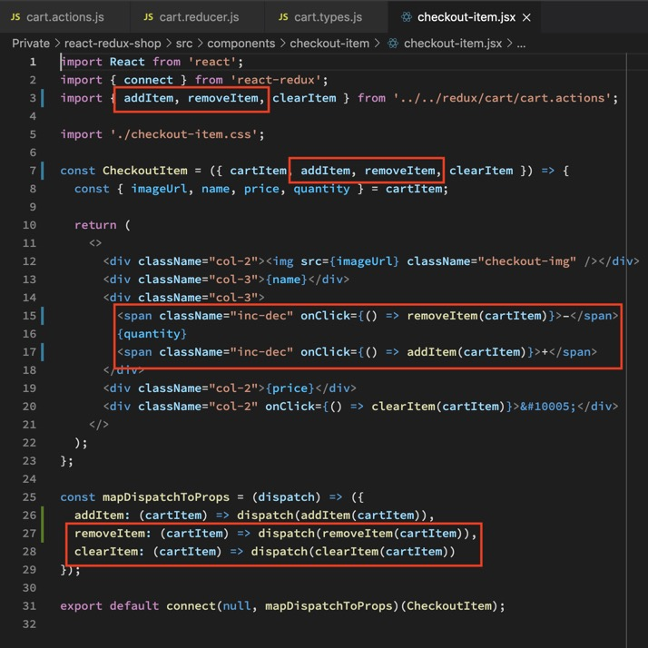

## [Shop 12] Local Storage mit Redux Persist

Der Unterschied zwischen window.localStorage und window.sessionStorage ist, wie lange Daten im Browser gespeichert werden. LOCAL speichert Daten solange bis man alle seine Browser Daten löscht. SESSION speichert sie solange man den TAB offen hat. Gespeichert werden können nur STRINGS.

Wir installieren also erst einmal redux-persist.

Wir erstellen eine PERSISTCONFIG in ROOTREDUCER JS, die sagt, welcher Reducer gespeichert werden soll. Wir brauchen das nur für den CART Reducer, nicht für den USER Reducer, da unser User von Firebase eh eingeloggt wird. Er ist also schon persistent. Dann wrappen wir PERSISTCONFIG und rootReducer in PERSISTREDUCER.

Auf Deutsch: Die Config sagt AB WO gespeichert werden soll (ROOT), mit welcher METHODE gespeichert werden soll (STORAGE) und WAS gespeichert werden soll (CART). Wir haben dem rootReducer, der in STORE JS zum STORE verarbeitet wird, also nur eine Config mitgegeben die sagt, WAS WIE persistet werden soll.

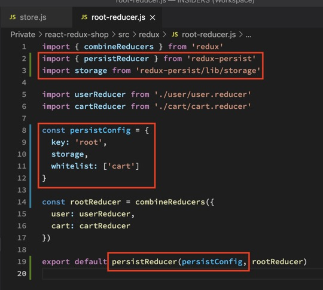

Wir erstellen dann den PERSISTOR mit PRESISTSTORE in unserer STORE JS.

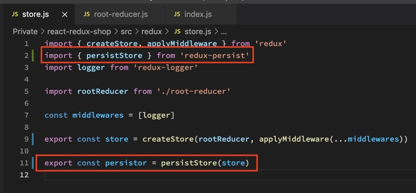

Danach wrappen wir unsere App in PRESISTGATE.

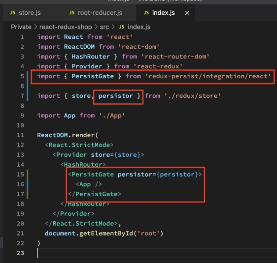

Und wir sehen unser Redux Store gets rehydratet mit Cart Items wenn wir die Seite neu laden.

Wollen wir die Funktion wieder entfernen suchen wir einfach nur nach allem mit den Wort PERSIST.

## [Shop 13] JSON Strukturen in den Redux Store integrieren

Homepage und Shoppage holen sich ihre Daten aktuell aus dem lokalen State.

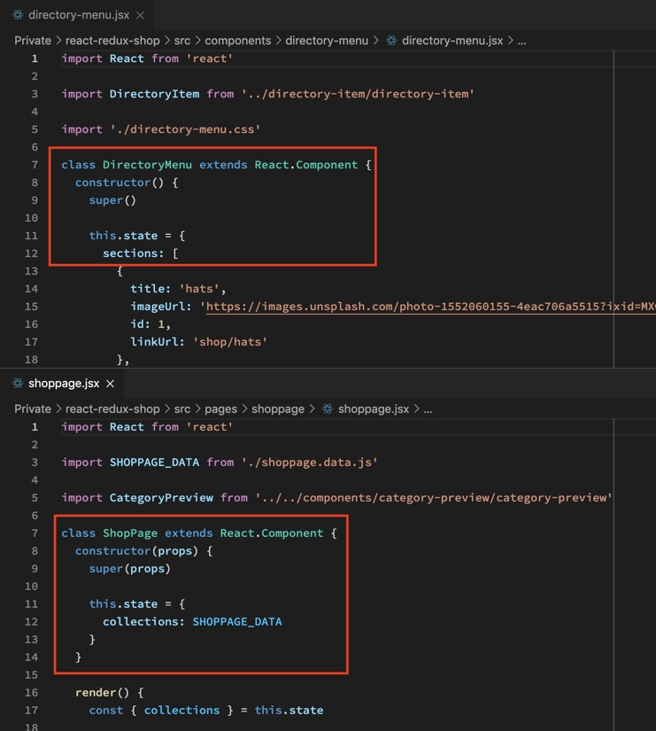

Das bauen wir um. Die Schritte für beide JSON Strukturen sind exakt die gleichen.

## [Shop 14] React Router mit dynamischen Parametern

Jetzt wo die Shoppage keinen State mehr hat können wir sie entkernen indem wir das Mapping über die Collection in eine separate Component CollectionOVERVIEW verlagern.

Da wir nun eine leere Shoppage haben, ist der Weg frei für besseres Routing, denn im Moment führt die Homepage auf Kollektionsseiten die nicht existieren. Also erstellen wir eine COLLECTION page.

Jetzt können wir mit React Router zwischen CollectionOverview (die alte mit dem 4er-Filter) und CollectionPage (brandneu und aktuell leer) hin- und herwechseln, je nachdem was dem MATCH (/shop/) von der APP ROUTE für ein PARAMETER mit DOPPELPUNKT „:name“ angehängt wird.

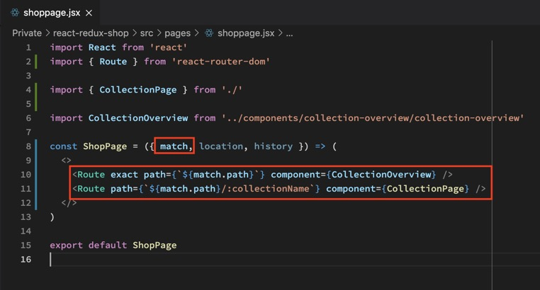

Um das nun auf der CollectionPage korrekt anzuzeigen, schreiben wir einen SELECTOR in unseren Redux Ordner. Problem: Die IDs im JSON sind Ziffern. Der Path in der URL sind aber Strings. Das heißt, wir müssen sie ersteinmal gegeneinander MAPPEN. Dann suchen wir im Selector mit FIND danach und können per Selector darauf zugreifen.

Das heißt, geben wir nun den PATH vom MATCH in den SELECTOR, spuckt der nicht mehr den PATH, sondern die ID im JSON aus.

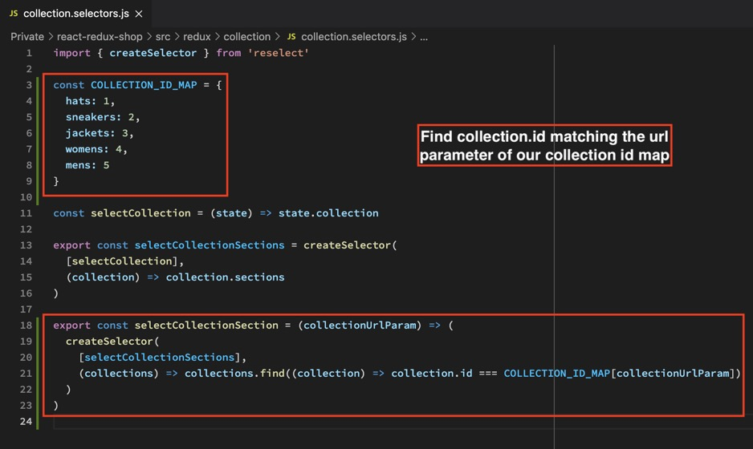

Das heißt, wir können den SELECTOR jetzt auf unserer CollectionPage nutzen, da dort ja der PATH über die MATCH PROPS reinkommt.

VORHER NACHHER CODE

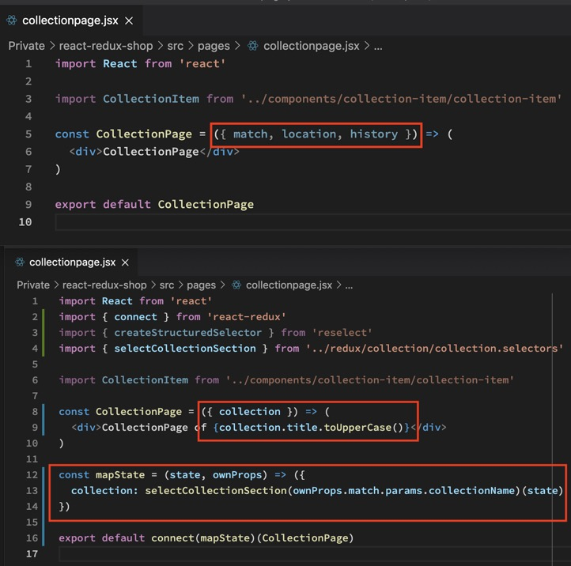

match, location history haben wir durch den zweiten, optionalen parameter in MAPSTATE ersetzt: OWNPROPS. Die OWNPROPS (inkl den URL PATH), geben wir in unseren SELECTOR, der das korrekte Objekt aus der Json ausspuckt.

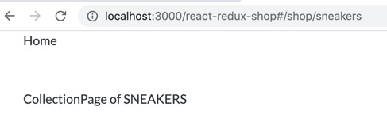

NOTE: Aufgrund der dynamischen URL ist der Slector nicht MEMOIZED. Abhilfe schaffen hier Libs wie lodash.memoize.

Jetzt können wir die tatsächliche Shop Unterseite bauen. Sie ist identisch mit der Shop Preview Seite, nur diesmal wird nicht für 4 Items gefiltert sondern einfach alle angezeigt.

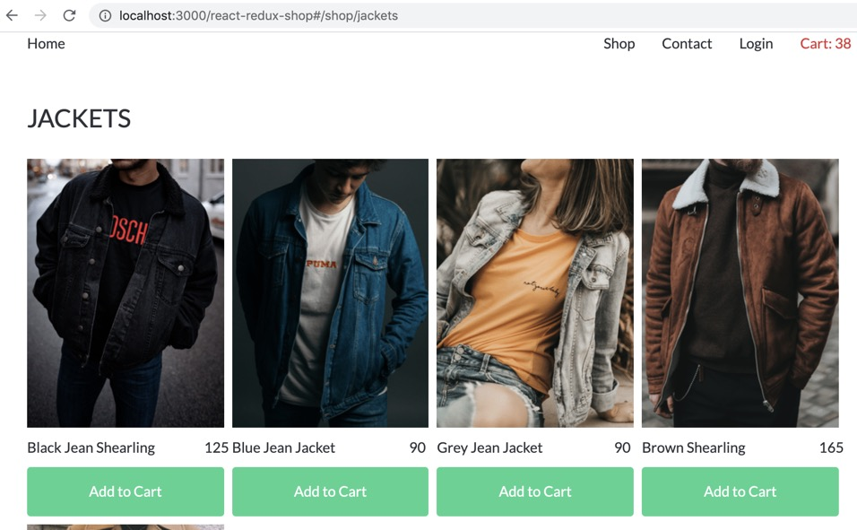

## [Shop 15] Data Normalization

Das Problem mit unserem Object Mapping ist, dass es bei 5 Einträgen kein Problem darstellt, bei 100.000 aber schon.

Siehe: Hashtables vs Arrays

https://www.kirupa.com/html5/hashtables_vs_arrays.htm

Statt durch 100.000 Objekte zu filtern (was Zeit kostet), können wir das Objekt aber auch einfach umschreiben.

Dazu gibt es hier eine nützliche UTIL Function:

https://dev.to/danielpdev/normalize-your-complex-js-objects-21d9

Für unseren Code werden wir allerdings das Objekt selbst verändern.

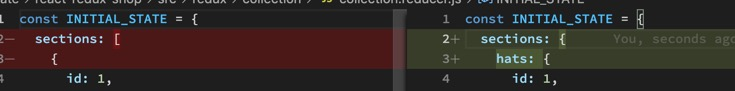

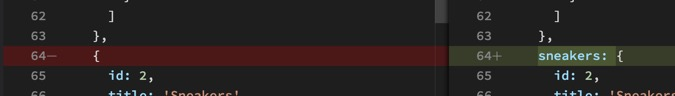

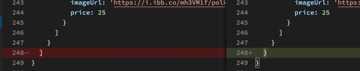

Jetzt kann auch unsere teure Mapping Function weg.

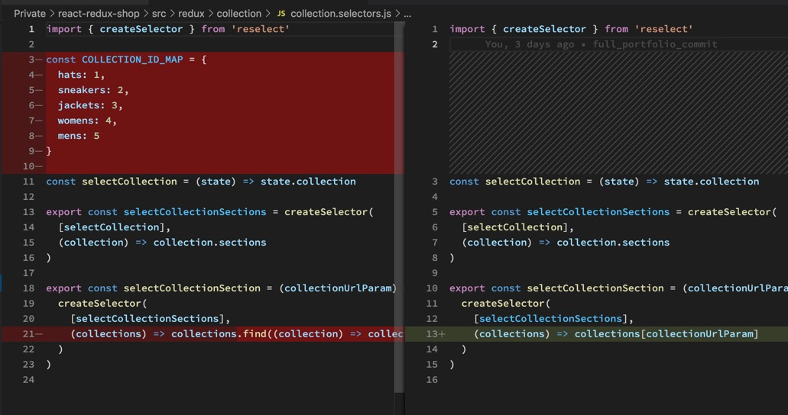

Jetzt brauchen wir noch einen Selector, der das Objekt wieder in einem Array verwandelt, damit wir im Frontend später noch darüber Mappen können.

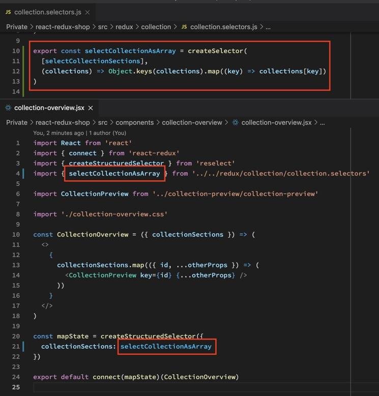

## [Shop 16] Fetching mit Redux Thunk

Mittlerweile ist unsere JSON Datei in Firebase gespeichert und wird per GET Request gefetched. Es gibt einen Loading State. Das gesamte Projekt ist auf Hooks umgestellt, unsere Pfade sind absolut und alle Redux-Dateien lose im Redux-Ordner.

Das letzte Ziel ist nun das Fetching mit Redux zu regeln. Mit Hilfe von REDUX THUNK.

Nach der Installation wird Thunk erst einmal dem STORE hinzugefügt.

Nun brauchen wir verschiedene TYPES die alle im REDUCER abgefragt werden.

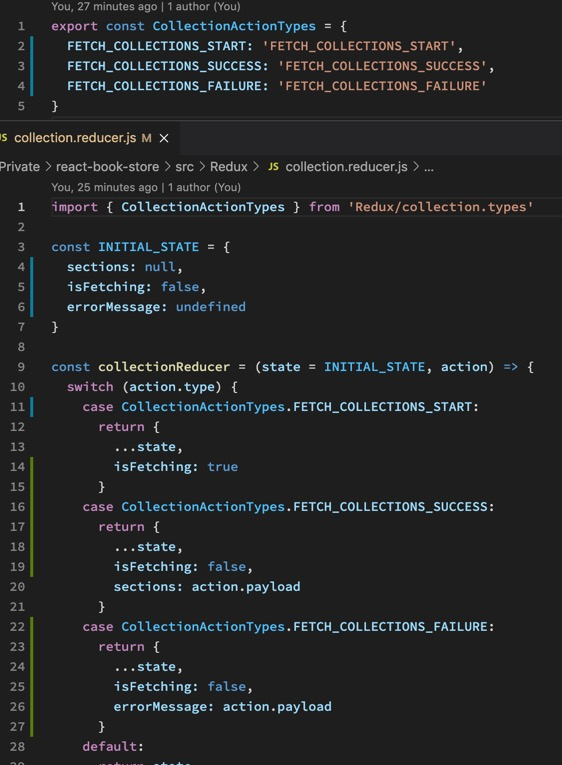

Für all diese TYPES schreiben wir ACTIONS.

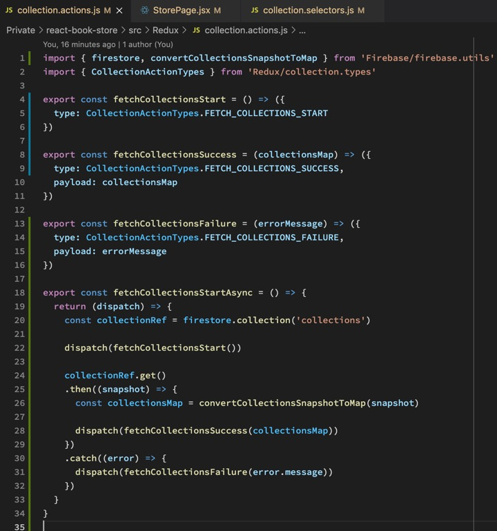

Mit Hilfe eines weiteren kleinen SELECTORS...

...können wir nun die Shop Page auf THUNK umbauen.

Die Änderungen der Shop Page in der Übersicht:

Der Shop funktioniert fast vollständig, nur ein Reload auf /shop/category/ schlägt noch fehl, weil hier Werte erwartet werden die es beim rendern noch nicht gibt.

Wir schreiben hierfür einen neuen SELECTOR den wir mit in unsere LOADING Abfrage nehmen.

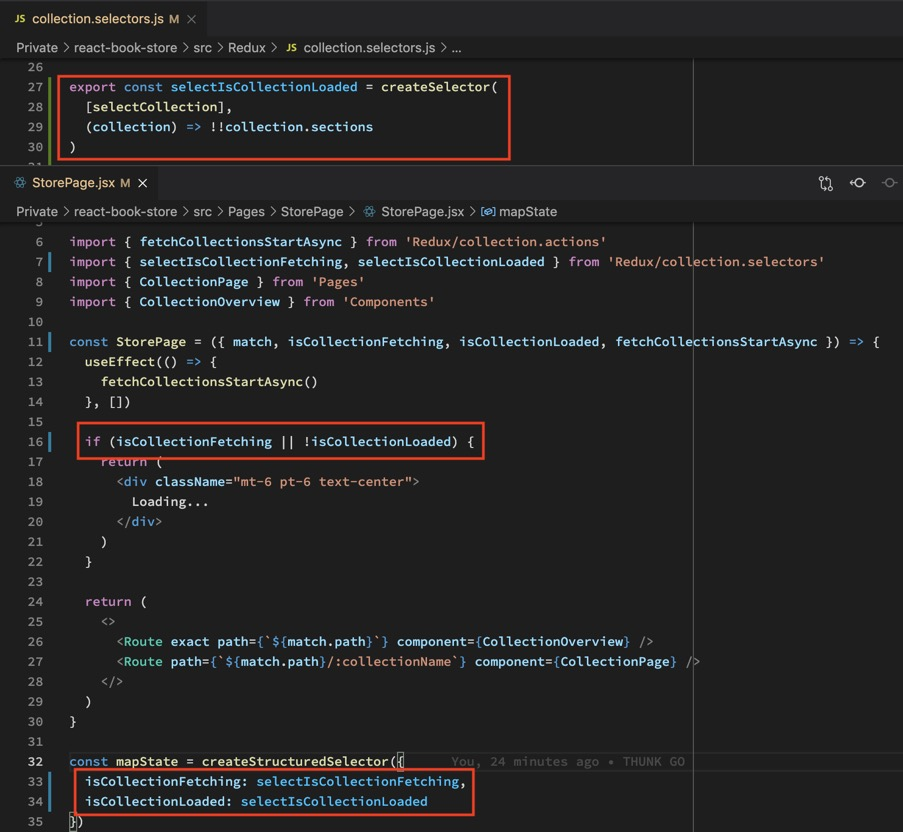
